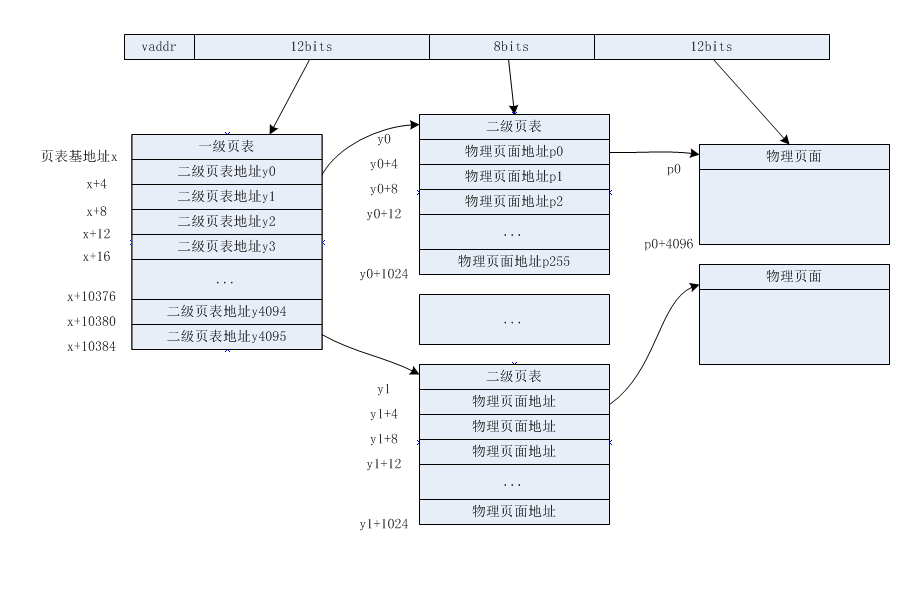
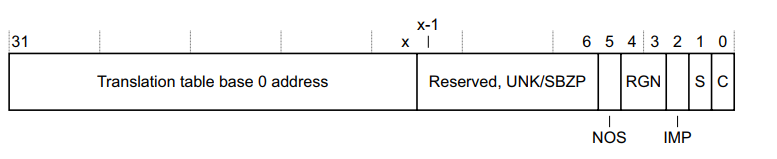
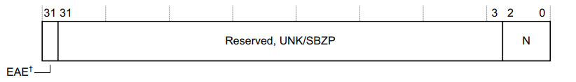
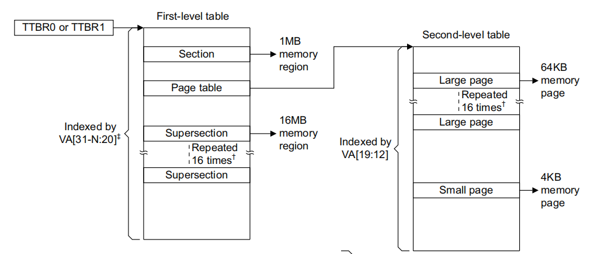
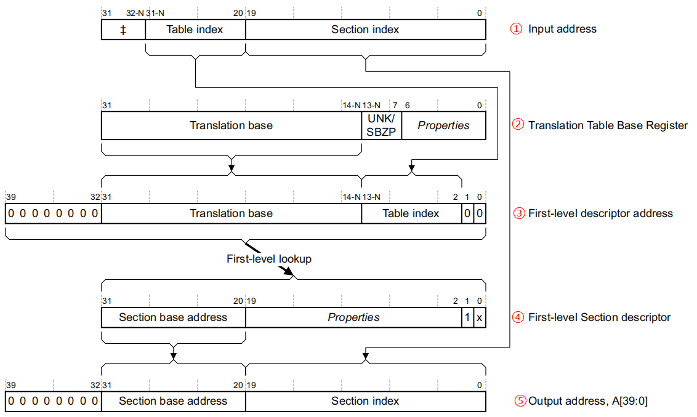
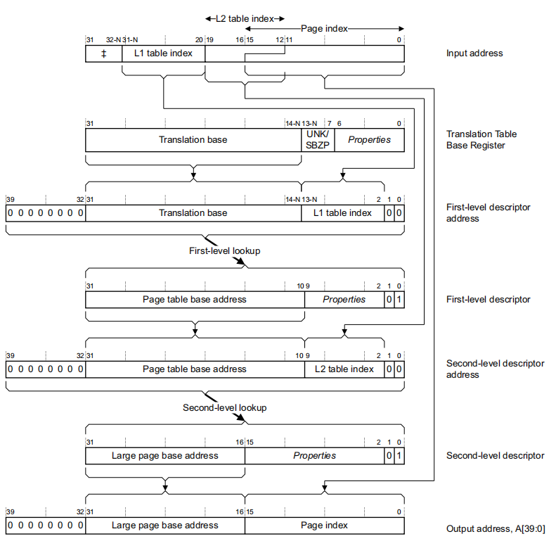
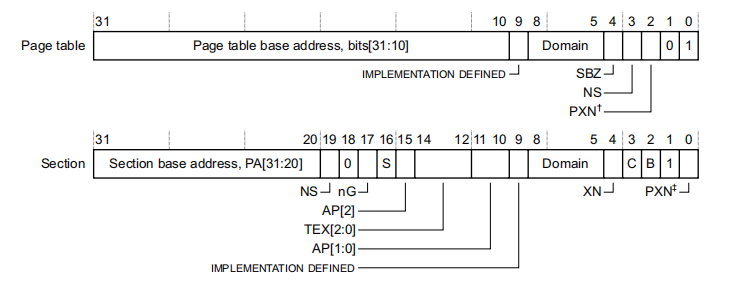

# arm 页表的硬件实现

在 MMU 出现之前，操作系统中的内存管理相对简单很多，开发者所操作的都是看得见摸得着的物理内存，内存的管理工作相对简单且容易理解，但是直接物理内存的管理总会带来各种各样的问题，比如安全问题，而且程序数据和硬盘上的普通文件数据并不一样，对内存地址有相当的依赖性，这也决定了让开发者直接操作物理地址是非常不方便，甚至是不合理的。

不知道你有没有听过这名言：

```
计算机科学领域的任何问题都可以通过增加一个间接的中间层来解决。
```

这句话几乎概括了计算机软件体系结构的设计要点.整个体系从上到下都是按照严格的层级结构设计的.

CPU 中的 MMU 就是引入的这个中间层，提供一种新的虚拟地址的概念，开发者面对的是虚拟地址，而 MMU 负责将虚拟地址转换为对应的物理地址，中间提供一层映射。 

引入虚拟地址最大的意义在于：开发者所操作的地址不再受到任何限制，不需要像使用物理内存那样考虑该地址上是否存在真实的物理内存，该地址是否已经被占用，只需要对 MMU 负责，而不需要对物理内存负责，这就提供了很大的操作空间。

一方面，开发者可以很方便地开发出可移植的程序，毕竟 MMU 可以确保程序所占用的虚拟内存的分配，另一方面，由于虚拟内存到物理内存映射的建立是自由的，开发者不能直接访问真实的物理内存，这也大大提高了安全性。


## arm 中的 MMU 

在 arm  中，MMU 是处理器内部的硬件资源，不像串口、USB 等硬件控制器是 SOC 厂商添加的，因此 MMU 的访问并不是以外设寄存器的方式，而是由处理器内部集成的 cp15 协处理器进行管理。

上文中提到，MMU 对外提供虚拟地址，并维护虚拟地址到物理地址的映射，那么 MMU 到底是如何工作的呢？

**(需要注意的是，硬件上，armv7支持多种扩展模式，比如 LPAE 地址扩展，security extension 安全扩展，virtualization extension 安全扩展，不同的扩展模式下对应不同的配置，本文只考虑一般情况，暂时不讨论扩展模式下的 MMU 以及页表设置，有兴趣的朋友可以参考 armv7 参考手册)。**


要了解这个，首先得知道一个概念：页表，这是内存管理中的核心概念。

简单来说：实际的应用中，物理内存通常是比较大的，比如一块 2G 的内存，也就是一片 2\*1024\*1024\*1024 个字节的内存区域，要把它用起来，自然就需要对它进行管理，通常是以 4K 的粒度来分割内存，每 4K 一个页面，这时候 2G 的物理内存在系统中就被分成了 1M 个页面。

至于为什么操作系统要以 4K 一个页面来管理内存，而不是使用更大或者更小的粒度进行管理，这是在内存利用效率和管理成本之间做权衡取舍的结果。

每个页面都需要在操作系统中进行记录，毕竟你要使用它，必须得知道它的起始地址、大小、是否已经被分配等信息，而记录每个页面的相关信息也需要内存，这就是管理成本。同时，既然操作系统是按照页面进行记录的，那么在使用内存时也是以页面为单位，但是实际的内存使用中并不会刚好用完一个页面，可能只有 2/3 页，默认情况下，剩下的 1/3 也就被浪费了，这就是内存的利用率。那么，那剩下的 1/3 是不是可以继续使用呢，当然也是可以的，但是操作系统又得花一些内存去记录那 1/3 内存的起始地址以及使用的相关信息，又增加了管理成本。 

不难得出，页面划分的粒度越小，所浪费的内存是越少，管理成本越高，划分粒度越大，可能浪费的内存越多，管理成本越低。 

这就像你新写了一本书，如果章节索引划分得很细，那么用户在读书的时候就可以很方便地根据章节目录找到自己想找的内容，但同时也意味着你的目录也会占用大量的页面，我想你肯定没见过半本目录半本内容的书吧。如果章节划分得很粗，目录所占用的页面较少，但是用户想找一个具体的内容又不太方便。 

上面所讨论的是物理内存和分页的概念，回过头来再看看，页表到底是什么？

MMU 提供虚拟地址空间，虚拟地址空间的大小等于 CPU 的线性地址宽度，32 位系统中默认是 4G，**页表其实就是一张映射表，主要记录了虚拟地址和物理地址之间的映射关系**，也就是说，当程序访问一个虚拟地址时，其对应的物理地址就是通过查找页表来找到的。  

**需要特别注意的是，页表并不是由 MMU 来建立，而是由操作系统建立，建立一个页表的流程通常为：**

* 程序因为某些原因需要申请一片内存，调用内核提供的申请页面接口
* 内核从物理内存中找到合适的物理页面以及其对应的虚拟页面
* 建立该物理页面到虚拟页面的映射表，并把这个映射表信息提交给 MMU
* 返回虚拟页面地址给申请者
* 申请者下次使用该段内存时，使用的是虚拟页面地址，MMU 通过查页表获取对应的物理地址，然后根据需求读写该段内存上的值

从这个过程可以看出，MMU 的作用只是维护页表，并提供页表的操作接口，毕竟物理内存和虚拟内存空间都还是得由操作系统来管理。

MMU 最主要的作用是维护页表，并将输入的虚拟地址访问转换为物理地址访问，同时还支持访问属性的控制，防止非法访问，向 CPU 报告异常。 


## 多级页表

对于 linux 这种支持多进程的操作系统，进程之间地址隔离的特性让每个进程看起来都拥有独立的 4G 地址空间，实际上不能算是 4G，内核部分是共享的，通常 3G~4G 地址空间是内核空间，因此，一个用户进程占用了独立的 0~3G 的内存空间。

也就是说，对于每个进程而言，虚拟地址对于物理地址的映射都是独立的，从而每个进程都需要一个独立的页表。 

让我们来计算一下，一个完整的页表需要多少项，计算过程很简单：4G / 4K = 1M，也就是一共有 1M 个页面，这些页面如何访问呢？


将开发者需要访问的虚拟地址的前 20 位作为页面偏移，该偏移值上保存的是对应的物理页面地址，占用 4 字节，20 位刚好对应 1M 空间，后 12 位用于页内偏移，索引到具体的物理页面上的内存字节，这样就根据虚拟地址查找到了对应的物理地址。 

也就是说，每个虚拟地址到物理页面的映射占用 4 bytes，那么一个完整的页表就需要 4M 字节，注意，因为每个进程是独立的，因此系统中每存在一个进程，就需要额外地为每个进程申请 4M 的内存空间，一个系统中存在 50 个进程并不夸张，仅仅是为每个进程分配页表，就要占用掉 200M 空间，这明显是非常不划算的。

同时，如果刚开始运行时申请 4M 内存不在话下，一旦内存中碎片多了，那么申请连续的 4M 空间是非常吃力的，为什么页表需要连续的空间呢？上文中有说到，页表的查找实际上是 MMU 执行的，软件只是将页表基地址交给 MMU，MMU 不能接受不连续的地址，这是硬件决定的。

解决这个问题的办法是使用多级页表，处理器是否支持多级页表以及支持页表的级数也是由硬件决定的，arm32 硬件上最多支持二级页表，也就是支持使用一级或者二级页表，主要使用二级页表。

多级页表有什么好处呢？

在二级页表的结构中，第一级的页表的内容不再指向具体的物理页面，而是指向第二级页表的地址，而第二级页表的内容指向具体的物理页面，以此索引到具体的物理地址。

二级页表虚拟地址到物理地址的映射可以参考下图：



通用的二级页表映射中，每个页面的 size 依旧是 4K，32 位的虚拟地址被解析为三个部分，首先，一级页表的基地址被传递给 MMU，当程序发起一个虚拟地址的访问时。

一级页表一共 4096 项，MMU 取出虚拟地址的前 12 bits * 4，就可以根据地址索引找到一级页表中对应的项，该项中保存的是二级页表的地址。

二级页表一共 256 项，MMU 取出虚拟地址的中间 8 bits * 4，就可以根据地址索引找到二级页表中对应的项，该项中保存的是物理页面的基地址。

知道了物理页面的基地址，MMU 再取出虚拟地址的最后 12 bits，作为物理页的页内偏移，寻址到具体的内存地址。   

在上述这种二级页表的结构中，MMU 并不要求一级页表和二级页表存储在连续的地址上，这并不难理解，对于硬件来说，在查表时，只需要提供给 MMU 目标范围内的数据即可，比如在第一级查完之后，可以确定目标物理面落在了 0x00100000~0x001fffff 地址之间，那么内核只需要进一步提供这个区间的映射表即可。 

因此一级页表需要占用连续的 4096*4=16K 内存，而二级页表一共 4096 个，每个占用连续的 1K 字节，MMU 不要求所有二级页表保存在连续的地址上。

显而易见，页表的存储不再需要连续且大量的物理地址，这对新进程的创建时比较友好的，毕竟大片内存的申请随着系统的运行越来越难以得到。

另一个巨大的好处在于，大部分程序并不会使用所有的虚拟地址，往往只是其中的一小部分，这种情况下，二级页表完全可以做到按需分配，用到哪一部分的虚拟地址，就创建对应的二级页表，完全没必要将所有 4096 个二级页表一次性创建，二级页表相比于一级页表拥有更好的扩展性。 

采用二级页表的方案极大地解决了内存利用效率的问题，既然多级页表这么好用，那何不继而采用三级、四级页表呢？

实际上，在 arm32 扩展内存中，使用了三级页表，因为随着物理内存的增大，增加页表的级数可以节省页表空间，原理和上述一致，而 arm64 中支持 4 级页表，linux 因为要支持所有体系架构，软件上采用 5 级页表。

但是，从上文中虚拟地址到物理地址的转换中应该不难发现，采用多级页表的副作用是非常明显的，采用二级页表将导致访问一个虚拟地址需要经过两次内存访问，第一次访问到二级页表，第二次才能访问到真正的内存，多级页表的访问次数也是线性增加，尽管处理器中的缓存器件可以缓解这个问题，但是随着页表级数的增加，内存访问时间延长是必然的。 


## arm 中页表的硬件特性

页表实际上是硬件和软件合作的产物，虚拟内存和物理内存都是由操作系统管理的，虚拟地址到物理地址的映射也是软件进行设置，这是软件层面。

而硬件层面，MMU 规定了软件需要将存储页表的物理基地址提交给特定的寄存器中，且保证每一级页表的内容需要占用连续的物理地址，这样 MMU 才能通过地址偏移找到对应的物理地址。

### 页表相关寄存器 

#### TTBR0寄存器

在  arm 中，TTBR0 寄存器中保存的是页表基地址，注意这个基地址必须是页表对应的物理地址而不是虚拟地址，这并不难理解，开启 MMU 需要先初始化页表，但是如果不开启 MMU，就不存在虚拟地址这个概念，页表自然无法初始化，这就成了悖论。 

armv7 还支持 TTBR1保存页表基地址，但是 linux 中受限于内核与用户空间的分配比例，并没有使用 TTBR1，不管是内核中还是用户空间，都使用 TTBR0 保存页表基地址。

在没有多核扩展的实现中,TTBR0 寄存器内容为(支持多核扩展的 TTBR0 寄存器请参考 armv7 指令集架构手册)：

 

实际上，TTBR0 只是 bits[31:x] 位指定页表的基地址，其中 x 的值取决于 TTBCR.N bits，x =(14-(TTBCR.N))，为什么 TTBR0 只需要 (31-x+1) 位就可以找到页表基地址呢？

TTBCR.N 是 TTBCR 的 bit[2:0]，默认会被设置为 0，因此 x=14，也就是 TTBR0 的 bit[31:14] 作为基地址，软件设置页表基地址时，只需要保证该基地址是向  16K 对齐，就可以通过  bit[31:14] 找到页表基地址。这就像内核中一个变量如果向 4 bytes 对齐时，它的 bit[1:0] 是可以挪作它用的。 

NOS：Not Outer Shareable bit，该标志位指示页表相关内存是否是外部可共享内存。

RGN：同样是 cache 相关的属性设置，和 C bit 的区别在于这是设置 outer memory 的 cache 属性，而 C bit 针对 inner memory，这两者的区别在于 outer memory 会存在多 PE 之间的共享行为，因此需要考虑 cache 回写的策略。

IMP：IMPLEMENTATION DEFINED，取决于具体的处理器实现，需要参考 cortex-Ax 处理器手册。

S：Shareable 标志位，指示与页表遍历关联的内存的 Shareable 属性。

C：cache 标志位，决定页表的遍历过程是否支持 Inner memory 的 cache。


#### memory 模型

在 TTBR0 中，不难发现其 bit0-bit6 是针对页表基地址相关的内存访问属性，其中包括 inner、outer、shareable 等等这些概念，其实我也并没有完全理解这部分概念，就照着手册中写的翻译一下吧，有兴趣的朋友可以参考 armv7 手册以及 cortex-Ax 处理器实现手册：

首先，在 armv7 中，memory 被分为三类：

* normal memory
* device
* strongly-order

normal memory 是最常见的 memory 类型，我们所熟知的 DRAM、DDR，连接在系统总线上的 ROM 也算，也就是我们常说的内存设备。 


对于系统外设来说，这部分对应的外设内存是有一些特殊性的，表现在：

* 连续访问的 FIFO 缓冲区，不像内存操作那样可以自由寻址，写操作相当于 push queue，而读操作相当于 pop queue
* 对于 arm 的 GIC (终端控制器)而言，读寄存器操作同时会被视为中断响应，从而改变中断的状态
* 内存控制器的配置寄存器，用于设置普通内存区域的时序和正确性
* memory-map 类型的外设，访问对应的寄存器可能带有附加的操作，比如读状态寄存器同时自动清除该状态寄存器的某些 bit

device 类型和 strongly-order 类型的内存就就是上述描述的外设内存，至于 device 和 strongly-order 的具体区别，手册中没有看到，不过从名称上猜测，device 针对外设内存，而 strongly-order 指代上文中所说的 FIFO 缓冲区，必须要求顺序访问，这两种类型并不冲突，可能是并存的。

memory 除了被分为三种不同的类型，分别还对应不同的属性，比如：

* Shareability：共享属性，在没有实现 LPAE(地址扩展)的情况下，这个数据是 normal memory 特有的，这个概念相对简单，就是该 memory 是否支持被多个 PE(processor element，可以理解为核心)。
  共享内存又分为两个概念，inner shareable 和 outer shareable。
  inner 和 outer 是 arm 特有的概念，有点类似于 numa 结构，但是软件上又不能套用 numa 的概念，对于多核系统，x86 中使用 socket 的概念，一个 socket 通常包含多个同构核，单个 socket 也可以拥有自己的内存，这也就是 numa 节点，取决于处理器实现。
  而 arm 中提出的概念是 cluster，出于效率核功耗的考虑，一个 cluster 可能包含大小核，而在处理器的设计中，通常是 cluster 内部内存为 inner 域，多个 cluster 共享的为 outer 域。因此，一般的不支持多核的 arm 架构实现是没有 inner 和 outer 的区别的，即便是多核，也不一定存在 inner 和 outer 内存域，这完全取决于处理器实现。
* Cacheability：缓存属性，这个属性只针对 normal memory，普通内存的访问通常需要经过先将内存数据依次加载到多级缓存中，然后 CPU 与最近的缓存进行交互，利用程序的局部性原理，CPU 很可能多次对同一内存区域中的数据进行操作，这种情况下缓存就可以提升效率。
  device 和 strongly-order 类型的通常是不需要缓存的，毕竟这部分内存并不会被频繁访问到，比如通常并不会频繁地访问一个外设的状态寄存器，而是通过中断的形式通知 CPU，CPU 再去读取。 
  数据的缓存存在多种策略：
  * Write-Through Cacheable：写操作同时写入到缓存和内存，不难看出针对这类写操作是比较慢的
  * Write-Back Cacheable：写操作只写入到 cache，只在数据被替换出缓存时，才将数据回写到内存，这种类型更快，但是可能出现丢失数据的情况


#### TTBCR 寄存器

TTBCR 作为页表相关的控制寄存器，主要包含以下字段：



如果没有实现 security extension(不讨论)，TTBCR 寄存器只包含两个部分：

EAE：是否实现了 PAE 地址扩展，arm32 默认是 32 位地址线，可以通过 PAE 扩展到 40 位地址线，以扩展更大的内存。

N：决定了 TTBR0 中保存的页表基地址的对齐值，页表基地址为 TTBR0 bits[31:14-N]，当 N 为 0b000 时，向 16K 对齐。


#### MMU 使能寄存器

对于不包含 Security Extensions 的系统下，MMU 的开启和关闭由 SCTLR.M bit 控制，也就是 bit0。

**开启 MMU，意味着内存访问从物理世界跳转到虚拟世界，在 MMU 开启之前，CPU 发出的内存地址直接对应物理内存，而在 MMU 开启之后，CPU 发出的内存地址将会被 MMU 作为输入，查找 TTBR0 寄存器中指定地址的页表，根据页表找到相对应的物理地址，然后再是内存访问。**

**因此，在开启 MMU 之前，页表就必须准备好，但是并不要求该页表是完整的，实际上在初始化过程中，可以只建立需要访问的虚拟地址对应的临时映射页表即可，页表的配置实际上是存在一定的灵活性的。**


### arm 硬件对页表的支持

尽管上面的示例以及实际操作系统的配置中遇到的分页都是以 4K 为一个页面，实际上 armv7 架构支持多种分页方式：

* supersections：每一 section 包含 16MB 空间，这种配置下通常只需要一级页表，一般只会在支持 PAE 扩展的处理器中使用
* sections：每一个 section 包含 1MB 的空间，在内核中会用到，只需要一级页表
* large pages：64K 的大页面
* small pages：最常见的 4K 页面，通常实现为二级页表


当程序将页表地址设置到 TTBR0 寄存器中时，保存在页表基地址上的页表项被称为 一级描述符(first level descriptor)，一级描述符中可能包含以下内容：

* supersections 和 sections 的地址以及相关属性，这两者都只需要用到一级页表
* 二级页表的基地址以及相关的内存属性

如果软件配置为 4K 或者 64K 映射，一级描述符地址上就保存二级页表的地址，二级页表中的表项被称为 二级描述符(second level descriptor)，二级描述符中保存的是对应的物理页面基地址以及相应的属性位，一个完整的二级页表需要占用连续的 1K 物理内存空间。

实际上，在 MMU 查询获取到一级页表项之前，MMU 是不知道该虚拟地址对应物理地址的映射采用的是何种 page 大小，当获取到一级页表项之后，该页表项的最后两位表示页映射方式：

* 00：无效参数
* 01：page table，也就是表示当前虚拟地址的映射可能是 4K 或者 64K，使用二级映射，这种情况下一级描述符对应二级描述符的地址
* 10：section 或者 supersection，表示当前映射可能是 1M 或者 16M，使用一级映射，这种情况下以及描述符对应物理页面以及相应属性。 
* 11：等于 10 或者作为保留位，取决于具体实现。

一个比较反直觉的事实是，多种页表的映射方式在一个进程中是可以共存的，这并不冲突。

比如将内存地址开始的 0x00100000 ~ 0x001fffff 采用 section 映射到物理内存 0x800100000~0x8001fffff，也就是 1M 的空间，然后将 0x00200000~0x002fffff 这 1M 的空间采用 4K 的 page 映射，映射到物理内存 0x800200000~0x8002fffff 。

对于 section 映射，因为是 1M 对齐，输入的虚拟地址的高 12 bits 用于寻址物理页面基地址，而虚拟地址的后 20 bits 用于索引基地址上的具体字节，因此，只需要在页表基地址对应页表项填入 4bytes 的数据。

而对于 4K page 的映射，同样高 12 bits 用于寻址物理页面基地址，不过这个物理页面对应的是二级页表的基地址，因此需要程序额外申请一个 1K 的物理内存来存放二级页表(不需要与一级页表连续)。

参考下图：



这个示例可能不大容易理解，等你看完后面的虚拟地址寻址的实现再回过头来看这部分就应该可以看懂了，页表本身有些难以理解。 


### 虚拟地址的寻址

#### section 映射

前面讲了那么多，又是 MMU、又是页表又是内存访问属性，实际上只是为了引出最实际的问题：开启 MMU 之后，程序传入的虚拟地址访问是如何被 MMU 转换成物理地址访问的，在这期间页表起到了什么作用？

既然内核中有使用 1M 的 section 映射，就从简单的 section 映射讲起：




上图是直接从 armv7 指令集架构手册中截出的图，图中显示的是兼容了 LPAE 地址扩展实现，但是我们不讨论 32 bits 地址的情况，同时 TTBR0 寄存器中的 N 默认为 0。

1M section 的映射相对比较简单，只有一级映射，它的过程是这样的：

* 页表基地址上的 16K 内存保存着所有的 4096 项页表项，针对这 4096 个页表项，需要使用 12 bits 进行索引，因此，首先通过 TTBR0 获取页表基地址的高 20 bits，然后通过输入的虚拟地址的高 12 bits 就可以获取到对应的页表项基地址
* 页表项基地址对应的内存保存的是一级页表项，一级页表项的高 12 bit 保存的是物理页面的基地址，section 映射是 1M 对齐的，因此通过虚拟地址的低 20bits 用来索引物理页表的具体地址。
* 物理地址 = 虚拟地址对应页表项中保存的高 12bits 物理页面基地址 + 虚拟地址的低 20bits。
  而页表项基地址 = 虚拟地址高 12 bits + 保留的 8bits + 虚拟地址的高 12 bits。
  这就是通过虚拟地址和页表基地址求得最终物理地址的过程。 


#### 4K page 映射

4K page 的映射是最常用到的，实现的是二级映射，相对来说复杂一点，其实也说不上有多复杂，也就是原本应该指向物理页面的一级页表项内容改成了指向二级页表项地址，二级页表项指向 4K 物理页表，增加了一个中间层，至于为什么需要增加一个中间层，可以参考上文的讨论。 

4K 页面的二级映射是这样的：




跟 section 映射不同的是，4K page 的映射自然是 4K 对齐的，因此物理页面的页内寻址只需要 12 bits，而多出来的 8bits 作为二级页表项的索引，它的映射流程是这样的：

* 和 section 映射一样，一级的页表项占用连续的 16K 内存(实际上 4 种类型映射都是一样)，还是需要通过输入的虚拟地址的高 12 bits  来找到一级页表项地址。
* 一级页表项地址上的内容保存的是二级页表的基地址，二级页表一共 256 项，因此，使用虚拟地址的中间 8 bits 可以寻址到对应的二级页表项地址，一个二级页表占用连续的 1K 内存。
* 目标二级页表项上的内容保存的是实际物理页面的基地址，然后配合虚拟地址的低 12 bits 寻址到对应的内存。 

对于虚拟地址到物理地址的映射，建议各位自行反复推演，加深理解。 

需要再次强调的是，页表的内容是需要操作系统去设置的，不论是一级页表还是二级页表，MMU 只会根据操作系统提供的页表基地址以及提供的虚拟地址来从页表中找到对应的物理映射地址。

对于不同的进程，因为虚拟地址到物理地址的映射各不一样，从而在切换进程时也要切换页表，具体的操作就是将进程对应的页表基地址设置到 TTBR0 中，这样来看页表的切换是不是很简单。 


### 页表项属性

在上面的描述中，不难发现，不论是一级页表项(一级描述符)还是二级页表项(二级描述符)，实际上都只使用了部分的 bits，而另一部分 bits 是内存相关的属性，尽管这不是重点，不过也需要有一定的了解，比如你有没有想过：我们常说的程序加载器将程序的 .text 段映射到内存的只读区，这个 "只读" 属性是在哪里设置的？

#### 一级描述符




对于 section 映射，高 12 bits 用作物理页面基地址的索引，因此低 20 bits 都可以用作访问属性设置。而 page table 映射只有低 10 bits 可以作为访问属性设置。


Domain: 内存的 domain 域 . 详情参考 armv7 指令集手册 B3-1358.

SBZ : Should Be Zero 的简写,也就是这位没有意义.

PXN : 通常实现了 PAE(大物理内存地址扩展) 的架构才需要使用这个 位.如果支持,该位决定了处理器是否可以以 PL1 模式执行该区域的代码.

NS : Nonsecure bit,一般的 guest os 代码不会运行在  secure 模式下.


#### 二级描述符


nG:  not global bit, 在地址翻译时决定了 TLB 的缓存行为.

S : Shared bit,决定该地址区域是否是 share 类型的区域.

AP[2],AP[1:0] : 访问权限控制位,access permissions

TEX[2:0],B,C :内存访问属性

XN : Execute-never ,表示该位置的数据能不能被当成代码执行.


内存 inner 和 outer 区别：https://bbs.huaweicloud.com/forum/thread-19242-1-1.html

