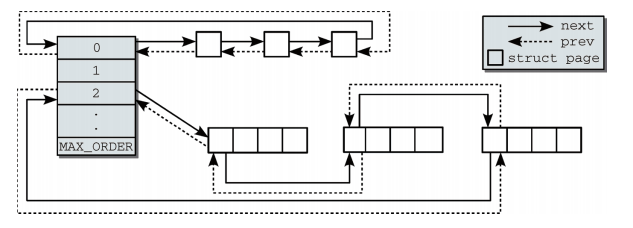
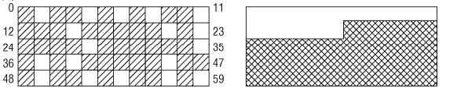

# buddy 子系统--数据结构与基本原理

## buddy 子系统基本原理

内核中，buddy 子系统的代码把所有平台抽象为 numa 架构的系统，非 numa 架构的系统被视为一个 numa node 的节点，从顶层来看，物理页面的管理首先划分为不同的 node，在 node 中再划分为不同的 zone(参考TODO)，实际的内存管理行为是以 zone 为单位进行的。

在 buddy 中有一个很重要的概念为 阶，用以表示物理页面的数量，n 阶表示 2 的 n 次方个页面，阶对应的是代码中的 order 概念，宏定义 MAX_ORDER 定义了内核中支持最大的阶数，也定义了 free_area 数组成员的数量，默认情况下，被设置为 11，也就是设置 free_area 中所管理的最大内存块为 2^11 = 2048 个物理页面，同时也可以通过内核配置修改该值，对应的配置项为 CONFIG_FORCE_MAX_ZONEORDER。

在一个 zone 中，所管理的所有物理页面被保存在 zone->free_area[MAX_ORDER] 数组中，buddy 子系统将物理页面以 2 的次方分割成不同的块大小，相同大小的页面以链表的形式连接，其链表头为 zone->free_area[n]，n 表示页面的阶数。

free_area 管理的页面链表如下：



如图所示，zone->free_area[2] 中保存的是 2^2 = 4 个页面大小的内存块，每个物理内存块的第一个页面作为链接节点被链接在 zone->free_area[2] 链表头所维护的链表上。

对于内核而言，自然是更喜欢连续的物理内存块，毕竟很多场景下使用连续的物理内存会更方便、更高效，在初始化阶段，内核对 zone 中所有的物理页面以最大的阶进行分割，并将其链接到 free_area[n] 中，余下的小块内存被放在不同的 free_area 数组成员的链表中，在这时候，情况是最理想的，zone 中的空闲内存都是大块的连续物理页。

buddy 子系统管理物理内存的最小单位为页，当用户调用页面分配接口时，传入的参数同样为阶 n ，也就是指定需要申请的页面数，接受到页面请求时，buddy 子系统自然会先去对应的 free_area[n] 链表上找空闲的内存，最佳的情况当然是直接可以找到满足要求的空闲内存并返回。

但是如果在当前阶的链表中没有满足要求的空闲内存时，就会在上一阶链表中寻找，因为上一阶链表中的内存块大小肯定是当前阶大小的两倍，因此上一阶链表中的内存分配完当前需要的内存之后，必然会剩下一半的物理页面，那么在分配时就将其一分为二，一半用来满足分配要求，一半将其添加到当前阶中，在分配时，如果上一阶也无法满足要求，这个过程是递归向上的，如果最大的阶也无法满足内存分配需求，此时可能触发内存回收以满足分配要求，也可能从其它的 zone 中借用。

因此，在内存分配时，原本大块的物理内存会随着内存分配不断地被分割成小块以满足用户的内存申请需求，内存也逐渐地碎片化。 

当用户使用完申请的内存之后释放时，就会将对应的内存块放回到对应的 free_area 数组成员链表上，比如 4个页面大小的内存块放回到 free_area[2] 中，除此之外，另外的一个操作是判断该数组成员上的其它成员是不是当前页面的 buddy，也就是这两个内存块是否能组成一个更大的内存块，如果可以就将其合并，并放入更高阶对应的数组链表中，这在一定程度上缓解了内存碎片的问题。 

为什么说是缓解而不是解决呢？可以参考下图：



图中阴影部分是已分配的内存，在一个 60 个页面的区域内，分配出去 34 个页面，剩下 16 个页面，理想状态下是右图中的情况，但实际情况通常是左图，尽管还有 16 个页面的空闲，但是在这个区域内尝试分配两个连续的内存页都将失败，这种情况就需要使用另外的内存碎片防治技术了，比如内存回收、内存迁移，以达到或者接近右边的理想状态，至于其它的内存碎片防治技术，这里就不过多赘述了。


## buddy 子系统数据结构

按照惯例，讲解一个模块之前自然需要先分析它对应的数据结构，数据结构中基本上包含了该模块的基本逻辑，对于 buddy 子系统也是一样，对于非 numa 架构的系统，全局变量 struct pglist_data contig_page_data 记录了整个 buddy 子系统相关的信息，访问该全局变量的接口为 NODE_DATA 宏：

```c++
#define NODE_DATA(nid)		(&contig_page_data)
```

其中 nid 表示 numa node 节点的 id，上面是非 numa 架构中的实现，该接口直接指向全局变量 contig_page_data 的地址。

contig_page_data 中包含的数据成员为：

```c++
typedef struct pglist_data {
	struct zone node_zones[MAX_NR_ZONES];
	struct zonelist node_zonelists[MAX_ZONELISTS];
	int nr_zones;
	struct page *node_mem_map;

	unsigned long node_start_pfn;
	unsigned long node_present_pages; 
	unsigned long node_spanned_pages; 
					     
	int node_id;

	unsigned long		totalreserve_pages;

	ZONE_PADDING(_pad1_)
	spinlock_t		lru_lock;
	...
} pg_data_t;
```

因为本系列文章主要针对 buddy 子系统内存初始化以及分配回收的实现，不涉及内存碎片、内存交换、内存压缩的处理，同时考虑到当前系统的硬件特性(比如不支持地址扩展、numa 架构)，因此省去了一些不重要以及不相关的数据成员,只关注一些核心成员。 

* node_zones：buddy 子系统中内存管理是以 zone 为单位的，也就是内存的分配在具体的 zone 内进行，关于 zone 的概念可以参考TODO，对于不同的 zone 有不同的特性，其内存管理的特性也有一些区别，每个 zone 对应一个数组成员，内核中支持多少个 zone 取决于硬件，硬件特性决定了软件配置，imx6ull 中 MAX_NR_ZONES 为 3，表示支持 3 个 zone，分别为 ZONE_NORMAL、ZONE_HIGHMEM 和 ZONE_MOVABLE。
  实际上，struct zone 结构才是 buddy 系统内存管理的体现，下文中将详细介绍。
  
* node_zonelists：当当前的 zone 无法满足内存分配的需求时，zonelists 用于指定备用 node zone 列表，这里的 node 表示 numa node，在非 numa 架构中，不使用 zonelists。

* nr_zones：node 中 zone 的数量，原本我以为这个值就是等于 MAX_NR_ZONES，但是本着严谨的态度看了一眼源代码，发现不是这么回事，nr_zones 这个成员针对的是实际管理了物理内存的 zone 的数量，也就是说，尽管有些 ZONE 被配置到内核中，但是实际上并没有真正地管理内存，就不算在 nr_zones 中。
  比如我手头上的这个 imx6ull 开发板，ZONE_MOVABLE 区域没有管理物理内存，尽管 MAX_ZONELISTS 为 3，但是 nr_zones 为 2，仔细一想也是，如果 nr_zones 恒等于 MAX_NR_ZONES，也就没有使用这个变量的必要了，直接使用宏就好，我猜测使用 nr_zones 记录真实使用的 zone 主要是减少在操作中没必要的遍历。 

* node_mem_map：struct page 数据基地址，每个页面都由一个 struct page 结构来管理，对于 FLATMEM 类型的内存模型，所有页面对应的 struct page 在启动阶段被统一申请，放在连续的物理内存地址上，node_mem_map 指向这片内存的基地址。

* node_start_pfn：该 numa node 中起始页面的页帧号，这里的 node 并非一定是 numa 架构所属，内核中将非 numa 架构抽象为一个 numa node 的 numa 系统，这样可以统一接口。

* node_present_pages：该 node 中已经给出的页面数，也就是实际页面数。

* node_spanned_pages：从当前 zone 的物理内存开始到物理内存结束地址对应的 page 数，包括内存空洞的，没有内存空洞时，等于 node_present_pages，否则大于 node_present_pages。

* node_id：当前 numa 节点的 id，非 numa 结构中该 id 为 0

* totalreserve_pages：所有 zone->lowmem_reserve 的统计值，指保留内存(待研究)。

* ZONE_PADDING：严格来说这不算是一个结构成员，它只是一个针对 cacheline 的填充，系统的 cache 通常是以 cache line 为单位加载内存的，一个 cache line 可能是 8 字节或者 16 字节不等，在多核系统中，多个 CPU 同时加载同一个 cache line 到各自缓存中，这并不是一件好事，尤其是当两个 CPU 同时修改同一个 cache line 中的数据时，将会 invalidate 另一个 CPU 上的 cache，导致另一个 CPU 上的数据需要完全地从内存中加载，这种 cache 一致性问题是比较麻烦的。
  回到正题，这里为什么需要使用 ZONE_PADDING 呢，ZONE_PADDING 本意是填充当前的 cache line，该指令后面的数据将会放到另一个 cache line上，有些类似于结构体中为了对齐而填充的空字节，这种操作的原因在于将  lru_lock 成员放到另一个 cache line 上，因为它经常会被操作到，而前面的某些数据也经常被 CPU 操作到，这两者又并不通常会被一起操作，将它们分到不同的 cache line，这样在不同的 CPU 分别访问这两个数据成员时就不会造成 cache 数据的竞争了。

  

### struct  zone

实际的内存管理是在每个 zone 内部进行的，因此继续深入到 struct zone 结构中：

```c++
struct zone {
	/* zone watermarks, access with *_wmark_pages(zone) macros */
	unsigned long watermark[NR_WMARK];

	long lowmem_reserve[MAX_NR_ZONES];

	struct pglist_data	*zone_pgdat;
	struct per_cpu_pageset __percpu *pageset;

	/* zone_start_pfn == zone_start_paddr >> PAGE_SHIFT */
	unsigned long		zone_start_pfn;

	unsigned long		managed_pages;
	unsigned long		spanned_pages;
	unsigned long		present_pages;

	const char		*name;

	int initialized;

	/* Write-intensive fields used from the page allocator */
	ZONE_PADDING(_pad1_)

	/* free areas of different sizes */
	struct free_area	free_area[MAX_ORDER];

	/* zone flags, see below */
	unsigned long		flags;

	/* Primarily protects free_area */
	spinlock_t		lock;

	/* Write-intensive fields used by compaction and vmstats. */
	ZONE_PADDING(_pad2_)


} ____cacheline_internodealigned_in_smp;
```

* watermark：水位值，这是一个数组，数组中包含三个成员：WMARK_MIN、WMARK_LOW、WMARK_HIHG，水位表示的是当前 zone 中剩余物理内存的占比，剩余物理内存占比高时，水位值就高，不难看出这个值就是为了记录当前 zone 中的剩余内存是否到达某个临界点，以便执行相应的操作。
  当水位值为 high 时，内存申请可以毫无压力地进行，当水位低到 LOW 时，这时候就要小心了，WMARK_LOW 相当于一个警戒水位线，某些内存申请操作可能不支持，如果水位到达了 WMARK_MIN，这时候说明物理内存的确是吃紧了，将会触发内存回收或者内存交换等机制。以避免触发 OOM(out of memory)。
* lowmem_reserve：在内存分配过程中，如果没有通过 gfp 标志位指定内存分配标志，当高一级的 zone 内存不足时，允许到低一级的 zone 中分配内存，比如 ZONE_HIGHMEM 可以从 ZONE_NORMAL 中分配内存，当然，这种策略是不得已而为之的行为，为了防止高一级的 zone 过渡挤压自己的内存，在 water mark 之外，低一级的 zone 会保留一些内存页面，放到 lowmem reserve 中。
* zone_pgdat：指向 contig_page_data  全局数据结构的指针
* pageset：这是 percpu 类型的结构，以链表的形式记录了一些物理单页，原本 buddy 子系统只使用 free_area 来组织并记录 zone 中所有的页面，pageset 是一种优化措施，一方面，内核中对应单页的申请比多页的申请要更频繁，因此该结构相当于对物理单页的缓存，减少单页的分配时间。另一方面，将这些单页与特定的 CPU 相关联，比如程序中频繁地申请释放单页时，可以更好地利用 CPU 缓存。而 percpu 机制可以比较好地解决多核之间的数据同步问题，有效利用 CPU 缓存。
* zone_start_pfn：当前 zone 起始页面的页帧号
* managed_pages：内核实际管理的页面，提供的物理页面并不一定已经被纳入管理，也可能被 reserved，暂时没有被管理，managed_pages = present_pages - reserved_pages
* present_pages：内核实际提供的页面，present_pages = spanned_pages - absent_pages(pages in holes)
* spanned_pages：当前 zone 对应起始页面到结束页面地址中包含的所有页面，包括内存空洞。spanned_pages = zone_end_pfn - zone_start_pfn
* name：zone 名称，通常用作调试输出
* initialized：是否初始化标志位
* ZONE_PADDING：设置 cacheline，见上文描述。
* free_area：这是 buddy 子系统的核心数据结构，每一个 zone 内所管理的空闲物理页面都会由这个结构进行记录，物理内存的分配回收也是在当前结构中管理的物理页面之间操作，这个结构相当于 zone 所维护的内存池
* flags：zone 相关标志位
* lock：实现数据保护与同步的 spinlock


对于 buddy 子系统，最重要的数据结构为 free_area，因此需要继续分析：

```c++
struct zone {
	...
	struct free_area	free_area[MAX_ORDER];
	...
}

struct free_area {
	struct list_head	free_list[MIGRATE_TYPES];
	unsigned long		nr_free;
};
enum {
	MIGRATE_UNMOVABLE,
	MIGRATE_MOVABLE,
	MIGRATE_RECLAIMABLE,
	MIGRATE_PCPTYPES,	/* the number of types on the pcp lists */
	MIGRATE_HIGHATOMIC = MIGRATE_PCPTYPES,
	MIGRATE_CMA,
	MIGRATE_ISOLATE,	/* can't allocate from here */
	MIGRATE_TYPES
};

```

在上文 buddy 子系统基本原理的介绍中， free_area 中每一个数组链表成员对应不同阶的物理页面，实际上这里面还有一些细节：free_area[n] 中不仅仅只包含一个链表，而是根据 MIGRATE_TYPES 分为多个链表，也就是对于 zone 中所有的 2 阶页面块(包含4个页面)，由 free_area[2] 进行管理，这多个的2阶页面块将会根据页面的迁移属性被链接到不同的链表上，因此更详细的 free_area 的管理结构为：TODO


water mark 参考：https://zhuanlan.zhihu.com/p/73539328

lowmem_reserve 参考：https://zhuanlan.zhihu.com/p/81961211