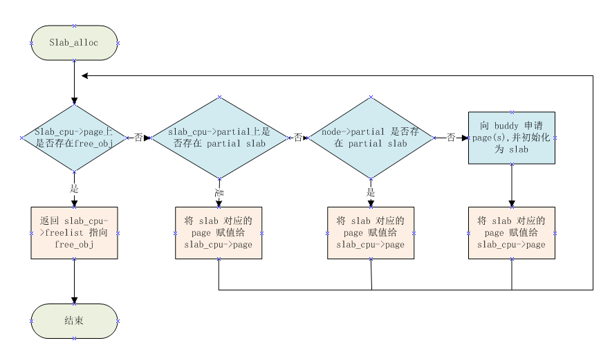
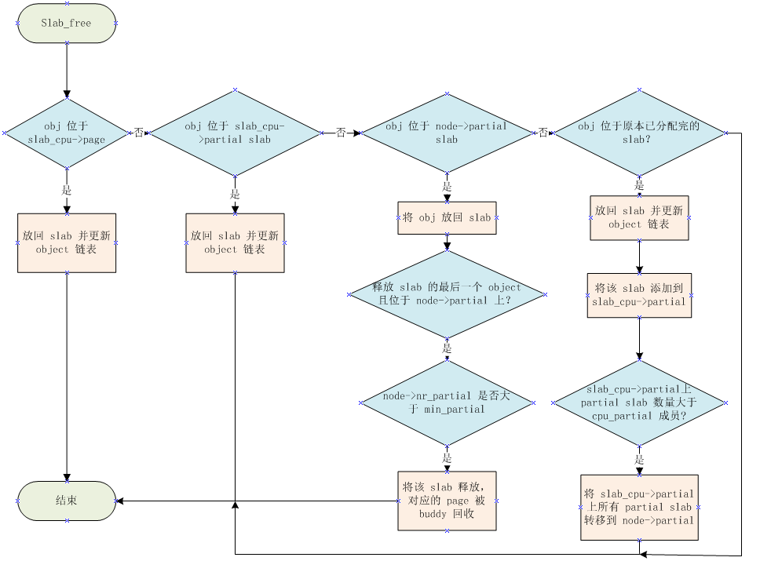

# 内核内存初始化 - slub 内存分配与释放

在上一章节中，分析了 slub 的初始化以及使用 kmem_cache_create 函数创建缓存对象，这一章就来看看 slub 是如何执行内存分配的。  

## kmalloc

kmalloc 算得上是最常用的内存分配接口了，它的底层实现大多数情况下都是基于 slub 分配器，在上一章分析的 slub 初始化中，已经为 kmalloc 函数分配了多个缓存对象，覆盖大多数 size 的分配需求。

kmalloc 的内存分配并不一定基于 slub 分配，在分配大内存的情况下，也可能直接使用 buddy 子系统分配页面。

首先，kmalloc 的源码实现为：

```c++
static __always_inline void *kmalloc(size_t size, gfp_t flags)
{
	if (__builtin_constant_p(size)) {
		if (size > KMALLOC_MAX_CACHE_SIZE)
			return kmalloc_large(size, flags);
		if (!(flags & GFP_DMA)) {
			int index = kmalloc_index(size);

			return kmem_cache_alloc_trace(kmalloc_caches[index],
					flags, size);
		}
	}
	return __kmalloc(size, flags);
}
```

其中 size 为需要分配的内存大小，flags 为分配标志位。

kmalloc 分配的具体策略是这样的：

* 申请者传入的 flags 表示内存申请的标志位或者标志位的集合，这些标志位为：

  * GFP_USER：由 user 发起的内存申请，可以睡眠
  * GFP_KERNEL：由内核发起的内存申请，可以睡眠，也是最常用的 flag 之一
  * GFP_ATOMIC：不能睡眠的内存申请请求，比如在中断处理函数中执行，可能使用到 emergency pools
  * GFP_HIGHUSER：从高端内存区申请内存
  * GFP_NOIO：尝试获取内存时不执行 IO 操作
  * GFP_NOFS：尝试获取内存时不发起 fs 调用
  * GFP_NOWAIT：不等待，也就是不能 sleep，申请不到就立即返回，不会睡眠等待内存的回收再分配
  * GFP_DMA：分配给 DMA 的内存空间，也就意味着返回的空间物理内存必须连续。
  * __GFP_COLD：从 buddy 的冷页发起内存申请
  * __GFP_HIGH：这里的 high 不是高端内存区，而是只内存分配动作的 high priority，更高的优先级促使内存分配可以使用 emergency pools
  * __GFP_NOFAIL：非常顽强的一个 flag，表示不接受内存分配失败，一直等待当前的分配成功返回，这个标志位需要慎用，内核给出的原句是：think twice before using。
  * __GFP_NORETRY：如果第一次尝试分配失败，直接放弃。
  * __GFP_NOWARN：失败不发出 warning
  * __GFP_REPEAT：分配失败时进行多次尝试。

  总的来说，kmalloc 执行内存分配时，上述的所有 flag 并不保证分配成功，__GFP_NOFAIL 会一直等待直到成功，当然也不一定能分配成功，也可能是一直等，实际上上述并不是所有的标志位，只是其它的标志位在一般情况下并不会使用到，所有标志位的定义在 linux/gfp.h 中。

* 使用 \_\_builtin_constant_p(size) 判断 size 是不是编译时常量，\_\_builtin_constant_p() 是 gcc 的內建函数，宏、常量、常量表达式以及 sizeof 关键字所计算得出的结果都是编译时常量，从上面的源码可以看出，用户传入运行时常量和非常量将会执行不同的分支。
  实际上，在分析两个分支的代码之后，并没有发现两个分支在逻辑上有什么不同，为了弄清楚这里为什么需要区分常量和非常量，查看了相关的 git commit 和内核 document 都没有结果，最终还是在 stack overflow 上找到[答案](https://stackoverflow.com/questions/48946903/large-size-kmalloc-in-the-linux-kernel-kmalloc#:~:text=Operator%20__builtin_constant_p%20is%20gcc-specific%20extension%2C%20which%20checks%20whether,kmalloc%20%28100%2C%20GFP_KERNEL%29%3B%20then%20the%20operator%20returns%20true.)，实际上这和逻辑没有关系，而是一种优化策略。
  如果用户调用 kmalloc 时传入的是常量，内核在编译时编译器可以直接对代码做分支优化，如果传入的 size 大于 KMALLOC_MAX_CACHE_SIZE，kmalloc 就会被优化为：

  ```c++
  static __always_inline void *kmalloc(size_t size, gfp_t flags)
  {
  	return kmalloc_large(size, flags);
  }
  ```

  如果小于 KMALLOC_MAX_CACHE_SIZE，将被优化为：

  ```c++
  static __always_inline void *kmalloc(size_t size, gfp_t flags)
  {
      if (!(flags & GFP_DMA)) {
  			int index = kmalloc_index(size);
  
  			return kmem_cache_alloc_trace(kmalloc_caches[index],
  					flags, size);
  		}
  }
  ```

  但是如果 kmalloc 调用这传入的是变量，就只能老老实实地编译成这样：

  ```c++
  static __always_inline void *kmalloc(size_t size, gfp_t flags)
  {
  	return __kmalloc(size, flags);
  }
  ```

  __kmalloc 的执行属于慢路径。

  同时需要注意的是，kmalloc 函数被声明成 \_\_always_inline 是完全有必要的，如果 kmalloc 是一个普通函数，那么传入的 size 始终是一个变量，也就没有分支优化这一说了。 

  这种优化可以减少代码分支，降低分支预测的风险，毕竟 kmalloc 在内核中的使用非常频繁，这种优化是完全有必要的。

* kmalloc 的第二步是判断 size 是否大于 KMALLOC_MAX_CACHE_SIZE，对于两个不同分支都是一样，这个宏限定了 kmalloc 使用 slub 还是 buddy 子系统的分界点，在大部分平台上，这个宏被设置为两个 page 的大小，也就是当需要申请的 size 大于两个 page 时，调用 kmalloc_large 函数，其底层实现是 alloc_page，即使用 buddy 子系统直接分配页面，否则使用 slub 管理器执行内存分配。

* 当使用 slub 执行内存分配时，首先需要根据 size 向 8 字节对齐并 round up(不足8的部分算作8) 获取对应 size 的 kmem_cache 结构，这些结构都是在初始化阶段所创建的 kmalloc 缓存对象，在基于该缓存对象调用 kmem_cache_alloc 函数，其底层实现为 slab_alloc。


## kmem_cache_alloc

实际上，kmem_cache_alloc 函数才是使用 slub 的正确姿势，也是 slub 专用的内存申请接口，slub 内存管理器实现的本意是用户创建对应的缓存对象，然后从该缓存对象中申请 object，实现高效高利用率的内存管理。

kmalloc 更受欢迎只是因为用户申请释放同一内存结构的行为并不是非常频繁，没有必要创建专用的缓存对象，毕竟创建缓存对象本身也需要占用内存，因此内核抽象出这种需求，统一创建特定 size 的缓存对象，用户在申请内存时自动判断应该选择哪一种 size 的缓存对象，然后返回一个空闲的 object，这种方式实际上是会存在一定的内存空间浪费的。

而对于那些申请释放非常频繁的内存结构，就可以创建专用的缓存对象，以减少这种浪费，这种情况下，内存的申请就应该使用 kmem_cache_alloc 来申请指定 object，实际上 kmalloc 底层也是调用了 kmem_cache_alloc，只是多了一层封装，用于选择合适的 kmem_cache(缓存对象)。

kmem_cache_alloc 函数也是直接调用了 slab_alloc。


### slab_alloc

不论上层怎么封装，slub 内存分配的需求都汇聚到这个核心函数，用于分配内存，对应的实现为：

```c++
static __always_inline void *slab_alloc(struct kmem_cache *s,
		gfp_t gfpflags, unsigned long addr)
{
	return slab_alloc_node(s, gfpflags, NUMA_NO_NODE, addr);
}
```

slub 复用了 slab 的接口，因此依旧使用 slab_alloc 函数命名，slab.c 和 slub.c 文件中都有其实现，根据内核配置选择对应的实现，

slab_alloc 传递三个参数：s 为缓存对象的 kmem_cache，gfpflags 不用多说，addr 实际上传入的为 \_RET\_IP 宏，同样是个內建函数，获取程序的返回地址，主要用于调试打印，和内存申请本身的逻辑没关系。 

slab_alloc 直接调用 slab_alloc_node，多增加了一个 node 参数，正如前面章节所说的，在内存管理部分内核将 NUMA 架构和非 NUMA 架构代码进行了整合，也就是将所有系统都视为 NUMA 系统，而非 NUMA 系统被视为 单 NUMA 节点的 NUMA 系统，这样可以统一接口，NUMA_NO_NODE 表示非 NUMA 系统。


slab_alloc_node 是 slub 内存分配的核心实现，涉及到比较多的实现细节，针对这种情况还是采用惯例，主讲逻辑，只贴关键的代码：

* slub 的分配分为两种情况，fast_path 和 slow_path，在 kmem_cache 创建初期，就会为当前缓存对象创建 percpu 类型的 slab_cpu 缓存，所有的 object 保存在 slab_cpu->page 指向的页面中，其中 slab_cpu->free_list 指向 page 中第一个空闲的 object，而 percpu 类型的 slab_cpu 也是申请和释放的优先区域。
  因此，当 slab_cpu->page 存在且 slab_cpu->freelist 不为 NULL 时，说明当前 percpu 的 slab 中有空闲 object，直接设置 freelist 为下一个空闲 object，然后返回当前空闲 object 即可，也就完成了本次内存申请，大部分的 slub 申请都会走 fast_path 分支。 
* 当 slab_cpu-> page 不存在或者 slab_cpu->free_list 为 NULL，表明当前优先分配区已经没有空闲的 object  了，此时需要关中断，针对关中断这里需要多说两句：在内核中，关中断这种行为实际上是不推荐的，毕竟中断一关，也就意味着中断、中断下半部、内核抢占都不会再发生，这会严重影响内核的实时性。
  
  另一方面，也是很容易被误解的地方，就是在多核系统中关中断这个操作并不能防止中断与当前进程的数据同步，因为中断程序依旧会在其它 CPU 上并发执行，因此，仅仅是关中断的操作只是为了防止进程被其它程序执行流打断，这里的关中断是为了确保当前进程不会被切换到其它核上执行。
  进入 slow_path，slow_path 分为几种情况：
  
  * node unmatch，也就是在 NUMA 架构中使用了不匹配节点的内存，需要尝试释放 slab 从本节点的内存中申请新的 slab，跳到 new_slab 标号处，NUMA 相关的操作不进一步讨论。
  * slab_cpu->page 为空，也就是 slab_cpu 上已经没有可以优先分配的 slab 了，这种情况多发生在当前 slab 已经被分配完，freelist 为 NULL 实际上也意味着优先分配的 slab 已分配完，跳到 new_slab 标号处。一个需要注意的点是，当 slab_cpu->page 对应的优先分配 slab 被分配完之后，该页面就被 slub 直接抛弃了，也就是 slub 并不维护该页面，实际上也不需要维护，因为在 object 的释放时，完全可以通过 object 的虚拟地址来确定所属的 page。而在 debgug 模式下，被分配完的 slab 将会链接到 pernode 的 full 链表中用作调试。
  * new_slab 标号处：查看 slab_cpu->partial 链表上是否存在 slab，该 partial 同样是 percpu 的，相对于 slab_cpu->page 来说是备用分配区，该链表上的 slab 通常是半满的状态，如果 slab_cpu->partial 上存在可分配的 object，就将其 slab 对应的 page 赋值给 slab_cpu->page，作为优先分配的 slab，然后将空闲的 object 返回，并更新 freelist 列表。
  * 如果 percpu 类型的 slab_cpu->partial 链表上也不存在 slab 节点，别忘了还有一级 pernode 类型的 partial 链表，既然前面的分配都满足不了，那就只能从该 partial 链表中找可使用的 slab，如果找到了 partial slab，就将其交由 percpu 的 slab_cpu 管理，然后从其中分配空闲的 object。
  * 最后一种情况是：不仅优先分配区没有空闲 object，连两个备用缓存的 partial 链表上也都没有，那就没办法了，只能重新构建一个新的 slab，调用 new_slab 函数，该函数首先从 buddy 子系统中申请页面，申请页面的数量取决于 kmem_cache->oo 成员中的 order 值。
    然后将新申请的页面初始化为一个新的 slab，其中包括：page->objects、page->slab_cache、page->freelist、page->inuse、page->frozen 等 struct page 相关的成员初始化，同时还有 slab_cpu 相关的初始化，并将新的 slab 交由 slab_cpu 管理。
    创建了新的 slab 之后，拿出 freelist 指向的第一个 object 返回给申请者即可。
    需要注意的是，尽管这种情况下申请的页面会交由 percpu 的 slab_cpu 管理，但是并不是从 percpu 的内存区进行申请，而是从普通内存区申请。只是 slab_cpu 这个结构需要从 percpu 内存中申请，而不是 slab 对应的页面。 

下面是 slub 申请操作流程图：




## kfree

相对于内存申请，free 其实就是 alloc 的逆操作：

```c++
void kfree(const void *x)
{
	struct page *page;
	void *object = (void *)x;

	page = virt_to_head_page(x);
	if (unlikely(!PageSlab(page))) {
		__free_pages(page, compound_order(page));
		return;
	}
	slab_free(page->slab_cache, page, object, NULL, 1, _RET_IP_);
}
```

kfree 传入 kmalloc 申请的内存地址，因为 kmalloc 和 kfree 管理的都是线性映射区，通过地址可以定位物理页面的位置，从而根据偏移计算得到对应的 struct page 基地址。

假设目标页面是由 slub 进行管理，page->flag 中相应的 slab 标志将会被置位，否则就是由 buddy 子系统直接管理，因此，如果 slab 标志没有置位，调用的是 \_\_free_pages 释放 buddy 子系统分配的页面，否则就调用 slab_free，释放对应 slab 中的 object，而内存基地址也等于 object 基地址。


## kmem_cache_free

由 kmem_cache_alloc 申请的页面需要使用 kmem_cache_free 来释放，该函数传入两个参数，一个是代表缓存对象的 kmem_cache 结构，另一个就是 kmem_cache_alloc 返回的虚拟内存地址，该函数同样调用 slab_free 函数进行内存的释放。 

```c++
void kmem_cache_free(struct kmem_cache *s, void *x)
{
	s = cache_from_obj(s, x);
	if (!s)
		return;
	slab_free(s, virt_to_head_page(x), x, NULL, 1, _RET_IP_);
}
```


### do_slab_free

slab_free 直接调用 do_slab_free 函数，该函数和 slab_free 一样，接受 6 个参数：

```c++
static __always_inline void do_slab_free(struct kmem_cache *s,
				struct page *page, void *head, void *tail,
				int cnt, unsigned long addr);
```

其中，head 表示待释放的虚拟内存地址，tial 表示结束地址，cnt 表示需要释放的 object 数量，addr 和 slab_alloc 的 addr 参数一样，仅用于调试目的。

在 kfree 和 kmem_cache_free 的释放中，tial 和 cnt 并没有使用，这两个参数只是为了支持批量的 object 释放。


以下是 do_slab_free 的实现流程：

* free 同样存在两种情况：slowpath 和 fastpath，当释放的 object 正好位于当前优先分配的 slab 中，也就是属于 slab_cpu->page 中时，直接将 object 放入 page 中即可，具体操作就是更新 freelist 结构和 object 链表。

* 如果当前 object 不属于当前优先分配的 slab 中，也就执行 slowpath，slowpath 分为几种情况：

  * 当释放的 object 属于 slab_cpu->partial 或者 node->partial 中时，直接将 object 放入到对应的 partial slab 中，更新空闲 object 链表。
  * 当释放的 object 属于一个原本已经用完的 slab 时，释放这个 object 之后该 slab 就成为了一个 partial slab，原本的 page->freelist 需要修改为指向当前释放的 object，page->inuse 减去 1，同时该 slab 所属的 page 需要被 slub 重新管理起来，也就是将其添加到 slab_cpu->partial 链表上，因此 page->frozen 置为 1。该操作对应的函数为：\_\_slab_free->put_cpu_partial
    另一个需要考虑的情况是，当一个 full slab 变为 parital slab 时，都会被添加到 slab_cpu->partial 链表上，但是也不能无限制地添加，链表过长会导致操作效率的降低，因此， slab_cpu->partial 链表上的 partial slab 一旦超过某个值，就将所有的 slab 一次性全部转移到 per node 的 node->partial 链表上，这个触发转移的阈值就是 kmem_cache->cpu_partial 成员。该操作对应的函数为：\_\_slab_free->put_cpu_partial->unfreeze_partials.
    为什么是一次性全部转移而不是转移部分呢？
    我的猜测是：如果只转移部分，好处在于在频繁地分配操作时，当 slab_cpu->page 中对应的 object 分配完时，可以在同为 percpu 类型的 slab_cpu->partial 上找到可用的 partial slab，坏处是如果后续依旧是频繁地释放操作，那就需要频繁地往 node->partial 链表上转移 partial slab，而 slab_cpu->partial 上的 partial slab 超出限制本就意味着某个或者某些程序在执行频繁的释放操作，一次性全部转移更符合当时的场景。
  * 当释放的 object 是 partial slab 的最后一个 object 时，也就是该 partial slab 释放之后就变成了一个 empty slab，但是它不会被立即释放，而是当它被转移到 node->partial 上，同时 node->partial 上的 partial slab 数量即  node->nr_partial 超过指定的值，才会将该 empty slab 释放，也就是将该 slab 对应的 page 释放回 buddy 子系统。触发释放的 node->nr_partial 由 kmem_cache 的 min_partial 成员决定。min_partial 这个变量名有些歧义，容易让人理解为最小的 partial 数量，实际上是 node->nr_partial 达到这个数量且存在 empty slab，就释放 empty slab。
  该操作对应的操作函数为：\_\_slab_free->put_cpu_partial->unfreeze_partials->discard_slab。

  

  下面是 slub 释放操作流程图

  

### tid 成员的操作

在 slub 的源码中经常可以看到类似这样的代码片段：

```c++
do {
		tid = this_cpu_read(s->cpu_slab->tid);         
		c = raw_cpu_ptr(s->cpu_slab);                  ......................a
	} while (IS_ENABLED(CONFIG_PREEMPT) &&
		 unlikely(tid != READ_ONCE(c->tid)));          ......................b
```

percpu 的 slab_cpu->tid 是一个特定于 cpu 的变量，该代码片段执行的逻辑为：先读取当前 cpu 的 tid 字段，然后再获取当前 CPU 的 cpu_slab 结构，最后判断之前读取到的 tid 和 cpu_slab->tid 是不是一致，如果不一致，就需要重新执行这一过程。

看起来这样的操作好像并没有什么意义，实际上这是操作 percpu 类型变量的一个常见问题：在操作过程中进程可能切换到另一个 CPU 上，导致 CPU 操作到与之不匹配的 percpu 变量。

在这里，tid 和 slub 分配释放的逻辑没有关系，仅仅是为了防止进程突然切换到另一个 CPU 上，比如上面的 a 处，假设在执行完 this_cpu_read 之后，进程从 CPU0 上被切换到 CPU1 上执行，接下来获取到的 cpu_slab 就是 CPU1 对应的 cpu_slab，而 tid 是属于 CPU0 的，这自然不是操作的本意，会造成一些数据的混乱，而且非常难以调试。

因此，通过先获取 tid，然后在操作完成之后再次获取 tid 的方式来防止出现这个问题，如果出现了 tid 不一致，说明进程切换到了不同的 CPU，需要重新加载 tid 和 slab_cpu 的值。

实际上，针对 percpu 的进程切换到不同 CPU 问题，另一种方案是关抢占，只要当前 CPU 的内核抢占被关闭，当前进程就不会被切出，但是关中断是一种比较粗暴的做法，这会影响到内核的实时性，内核并不推荐使用关抢占的做法。毕竟在操作 percpu 变量的期间，是允许进程切换的，只是不允许当前进程切换到另一个 CPU，尽管重新 load tid 和 slab_cpu 效率不高，但是这种情况非常少见，对性能的影响不大。