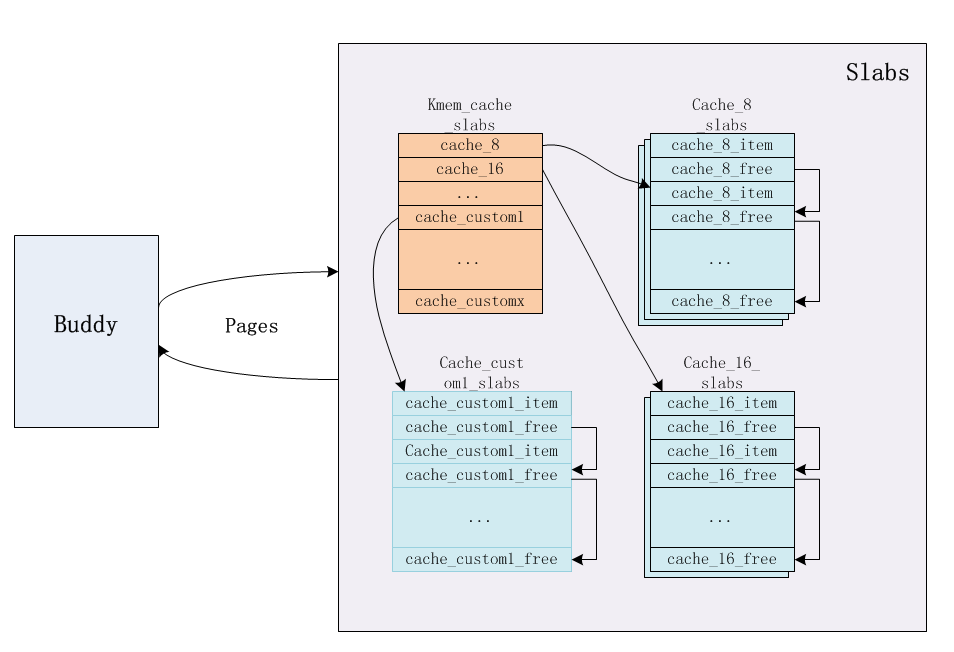

# 内核内存初始化 - slub 分配器

内核中 buddy 子系统管理内存的最小单位是页，页大小通常配置为 4K，出于效率的考虑，如果使用更小的页将会带来更大的管理成本，对于整个物理内存来说，尽管 4k 的粒度已经分得很小，但是对于普通程序来说，操作内存的最小单位为字节，通常都是几十到几百的内存申请请求，而直接使用一个页是非常浪费的。

最容易想到的解决方案就是对一个页面的复用，多个对象共享一个页面，一种方案是可以将 buddy 子系统的思路移植到页内分配，也就是将 4K 页内内存多块内存，以 2 次幂的大小分别链入不同链表，当用户产生内存分配的需求时(以字节为单位)，找到最近的一个满足条件的块给用户，如果没有，就将更大的内存块一分为二，再执行分配，和 buddy 子系统针对页面的分配思路一致。

尽管 buddy 分配算法在页面级的内存分配非常简单且高效，但是它并不适合用于页内内存分配。

一方面，内核中采用 4K 页面大小本就是基于内存利用率的考虑，大页面会造成在使用时页面空间的大量剩余，从而导致内存浪费，而更小的页面则导致页面管理数据量的急剧提升，单个页面的浪费问题解决了，但是页面管理上浪费了更多的内存。从设计上来说，buddy 子系统的管理成本并不低，数据结构相对复杂，为了保存 buddy 的数据结构就需要使用掉相当一部分内存，因此，需要管理成本更低的页内分配器。 

另一方面，以 2 次幂为一阶的内存分配方式在分配小内存时问题不大，假设如果想分配 130 字节的内存就不得不使用 256 字节的内存块，总感觉还是浪费严重，但是出于管理成本的考虑，又不能切分太多的块，因此，需要利用率更高的页内内存分配方式。 

针对这些页内内存分配需求，linux 内核采用了 slab 分配器， slab算法是1994年开发出来的并首先用于sun microsystem solaris 2.4 操作系统，后来被引入到 linux 中，slab 在一定程度上优化了内存利用率问题，其管理成本相对在可接受范围内。 

尽管slab分配器对许多可能的工作负荷都工作良好，但也有一些情形，它无法提供最优性能。slab 分配器的弊端在于其用来管理的元数据太多，同时复杂性也相对较高，在嵌入式系统或者配备大量内存的大型系统中不太适用，对于资源受限的嵌入式系统而言，需要更精简的内存管理器以占用更少的资源。而对于大型系统，slab 所使用的数据结构可能就需要占用数 G 的内存空间，这自然也难以接受。

因此，针对这些需求，在内核版本 2.6 的开发期间，增加了两种 slab 分配器的替代品：slub 和 slob。

* slob 分配器是针对资源受限型设备的优化，代码量小，管理数据所占内存得到优化，尽管在分配效率上略差于 slab，不过也是可以接受的。

* slub分配器通过将页帧打包为组，并通过struct page中未使用的字段来管理这些组，试图最

  小化所需的内存开销，同时简化了一些冗余的管理结构

随着 slub 的逐步优化，逐渐被内核开发者接受，同时也逐渐用来替换 slab 作为内核默认内存管理器，而随着硬件资源的发展，slob 的出场率并不高，至少在我所接触的平台中，不论是嵌入式平台 imx6ull、beagle bone、imx8，还是 PC 平台(基于 x86_64 的 ubuntu18)，都选择 slub 分配器作为页内分配器，本章内容也是基于 slub 分配器的讨论。

得益于内核优秀的抽象化设计，这三种内存分配器在接口上是兼容的，使用者只需要使用 kmalloc 申请内存，获得内核返回的内存并使用，并不需要关心底层的内存分配是如何实现的。内核开发者通过内核配置选择内存分配器。


## 基本术语

在下文的讨论中，使用的几个名词需要说明，以免混淆，这些并不是官方概念，只是为了讲解方便而定义的概念：

* 缓存：这里的缓存并不是 CPU 硬件上的概念，而是软件上的概念，slub 内存管理器就是基于缓存的机制实现的，即将 buddy 分配的页面平等分为多份放在内存中，等待用户的使用和放回，在 buddy 子系统的页面与 slub 对象中做了一层中间转换，也就称为缓存。 

* 缓存对象：在 slab 或 slub 中，针对的是特定的数据结构或者单一的对象执行内存分配，比如为内核中的 struct inode、struct dentry 结构建立缓存，也可以自定义结构进行缓存，这些被视为缓存对象。

* slab：slab 对应的英文名为块、板、组，在最先实现的分配器中，slab 用来表示一个缓存块组，包含多个缓存块，slab 内存管理器也因此得名，由于 slub 是基于 slab 的衍生版，因此也就使用了 slab 这个概念，因此在后文的阅读中请注意 slab 指的是 slab 内存管理器还是一个缓存块组。
* 缓存块(object)：对应程序中的 object，一个缓存块对应一个具体的分配对象，当用户分配内存空间时即返回一个空闲的缓存块，slub 是基于缓存块的管理


## slub 概览

由于 slub 是基于 slab 分配器衍生而来的，多数接口兼容，因此 slub 的实现代码中保留着一些 slab 分配器的概念，比如对于 slub 中的缓存块组，依旧称之为 slab(不是指 slab 分配器，而是缓存块组)。

那么，回到最核心的问题，slub 分配算法是如何工作的呢？

*  slub 基于 buddy 子系统，slub 分配器所占用的页面由 buddy 子系统分配而来，在特定时候也将释放到 buddy 子系统中
* slub 分配器基于一种缓存机制，是针对同一类型对象的缓存，也就是完整的页面会根据目标对象分成多个缓存块，每次分配内存就返回其中一块。这种由多个相同大小的块组成的页面就是一个 slab(注意这里所说的一个 slab 其实是一个缓存块组)，其实页内分配器其实并不是严谨的说法，只是为了表达 slub 是针对小内存的分配，这种内存分配是完全可能跨页的。因此，一个 slab 可能包含多个页面，只是通常对于比较小的缓存对象是一个页面。
* 系统默认创建了特定 size 的 slab 缓存块组，默认创建了 8、16、32(及以上) bytes 的 slab，基本覆盖了小内存的申请需求，且不会造成明显的内存浪费，同时，最大的特点是：内存申请者可以通过目标对象的大小自定义 slab，假设一个内核中出场率很高的结构需要频繁申请释放内存，占用 260 bytes，可以使用 kmem_cache_create 函数为其创建一个专用的 slab，该 slab 中包含连续且多个刚好为 260  bytes 的空闲缓存块，后续针对该对象的申请释放不会浪费哪怕一个字节的内存(在某些情况下可能会浪费一些对齐字节)，解决了内存在实际使用中利用率的问题。
* 内存利用率还取决于另一个因素：管理成本，也就是 slab 分配器本身要占用的空间。slub 中对一个 slab 的管理是基于链式结构，一方面，因为一个 slab 中缓存都是同一对象，因此不需要过于复杂的数据结构来管理，另一方面，slub 分配器巧妙地使用空闲页面来记录缓存对象，省去了一部分内存的开销。

slub 的整体框架如下：




每个 slab 占用连续的一个或多个物理页面，所有页面都是通过 buddy 子系统分配而来，在所有的 slab(slub 缓存组) 中，有一些比较特殊的 slab 成员，比如最典型的就是用于管理 slab 结构的 slab，说起来有点绕。

通俗来讲，假设内存需要调用 kmem_cache_create 为某个数据结构创建一个新 slab 时，首先需要做的并不是为 该结构申请内存空间，而是需要先申请一个 kmem_cache 结构，之后再针对目标对象申请对应的 slab 空间(就像组建一个小队需要先找一个队长来管理)，该数据结构用来管理新建的 slab，kmem_cache 占用较小的内存空间，也需要通过 slab 来管理，因此 kmem_cache_slab 中保存的就是所有的 kmem_cache 管理数据(该小队中全是队长)，从而体现出这个 slab 的特殊性。 

一个 slub 对象并不一定只包含一个 slab，当分配的一个 slab 用完时，会再次向 buddy 申请页面，分配新的 slub 缓存块组。

对于 slab 的管理来说，最基本的就是了解当前 slab 中哪些缓存块是空闲的，哪些是被占用的，slub 使用的方式是链式结构，同时只记录空闲缓存块，也就是 kmem_cache 中保存 slab 中第一个空闲缓存块的位置，而第一个空闲缓存块中保存下一个空闲缓存块的位置，依次类推，这种利用没有分配出去的内存来记录下一节点的方式节约了不少内存。


### slub 基本原理概述

对于一个缓存对象而言，一切的起点从 kmem_cache_create 开始，该接口返回对应 kmem_cache 结构，也就是管理该缓存对象的数据结构。在 kmem_cache_create 创建对象缓存时，同时会创建一个用于对象分配的 slab，这是个 percpu 类型 slab，以 cpu_slab 成员表示。

当用户开始申请缓存块时，slub 分配器扫描 cpu_slab，尝试找到一个空闲的 object，理想情况是存在空闲的 object 然后返回给请求者，如果不存在，就需要向 buddy 子系统申请页面并初始化为一个新的 slab，然后满足分配需求。

当用户释放缓存块时，可能存在多种情况：

* 释放的正好是当前 cpu_slab 上的 object，这种情况下直接将 object 放入即可，更新一下空闲链表
* 释放的是之前已用完的 slab，该 slab 变成一个 partial slab，需要将该 partial slab 重新管理起来，链接到 cpu_slab 的 partial 链表上，cpu_slab 的 partial 链表也不能无限存放 partial slab，当超过一定数量时将其转移到 pernode 的 partial 链表中。
* 释放的是 partial slab 上的 object，直接放进去即可，更新一下空闲链表
* 释放的是 partial slab 中的最后一个 object，也就是释放之后该 slab 为空，当这类空 slab 达到一定数量时，slab 会被释放，对应的页面被返回给 buddy 子系统。

当存在 partial slab 时，object 的分配会优先使用 cpu_slab 中缓存的 slab 分配，再使用 cpu_slab 上链接的 partial slab，最后使用 pernode 的 partial slab，直到所有 partial 被申请完，就再从 buddy 子系统中申请页面创建新的 slab。

更多的细节可以参考后续的源码分析。


## slub 数据结构

按照惯例，在简单介绍基本概念之后，我们先要来看看该组件的数据结构，从数据结构入手，了解 slub 的实现。 


### kmem_cache

kmem_cache 是 slub 中的核心数据结构，所有 slab 的管理都由  struct kmem_cache 结构执行：

```c++
struct kmem_cache {
	struct kmem_cache_cpu __percpu *cpu_slab;
	unsigned long flags;
	unsigned long min_partial;
	int size;		
	int object_size;	
	int offset;		
	int cpu_partial;	
	struct kmem_cache_order_objects oo;
	struct kmem_cache_order_objects max;
	struct kmem_cache_order_objects min;
	gfp_t allocflags;	
	int refcount;		
	int inuse;		
	int align;		
	int reserved;		
	const char *name;	
	struct list_head list;	
	int red_left_pad;	
	struct kobject kobj;	
	struct kmem_cache_node *node[MAX_NUMNODES];
};
```

* cpu_slab：percpu 类型的 slab，和 buddy 子系统中的 pcp page 一样，percpu 类型的 slab 是为了更好地利用 CPU 缓存，降低缓存失效的发生，该结构的定义如下:

  ```c++
  struct kmem_cache_cpu {
  	void **freelist;	
  	unsigned long tid;	
  	struct page *page;	
  	struct page *partial;	
  };
  ```

  * freelist：指向 slab 中第一个空闲的缓存块
  * tid：这是一个用作校验的字段，主要用来判断 percpu 的操作过程中进程是否切换到另一个 cpu 上，从而导致 CPU 与 cpu_slab 之间的不匹配，如果发生这种情况需要重新操作。
  * page：用于索引当前 percpu 类型 slab 所占用 page 或 pages，如果是多个 page，后续的 page 通过 next 指针相连。
  * partial：未满的 slab 缓存块组，被当成备用的分配列表，在分配的过程中自然是将一个 slab 用完之后再申请下一个，但是释放的时候可就没这么规律了，如果释放的是已经分配完的 slab，就会导致该 slab 需要被重新管理，也就放在该 partial 链表中，当前的 slab 分配完之后，会从 partial 中分配。 

* flags：slab 相关的标志位

* node[MAX_NUMNODES]：这原本是最后一个成员，因为它涉及到 slub 的基本实现机制，因此提到前面来讲。
  在 slub 中，每个缓存对象通常会维护两重 slab，一重就是上面提到的 cpu_slab，一重就是当前 struct kmem_cache_node 类型的 slab，后缀 node 表示该 slab 是 per node(NUMA node) 的，MAX_NUMNODES 就是 NUMA node 节点的数量，在非 NUMA 系统中就代表是所有CPU 共享的，在缓存块分配和释放的时候，自然是优先处理 percpu 类型的 slab，毕竟分配效率高，但是也不能无限制地扩展 percpu 类型的 slab，因此就会使用到 per node 的 slab，其实这种策略也相当于是做了一层缓存，在 per node 类型的 slab 之后，就是 buddy 子系统，当缓存对象对应的空闲 slab 过多时，需要将页面返回给 buddy，如果用完了，就得从 buddy 申请，以维持一种动态的平衡。 
该结构对应的成员如下：
  
  ```
  struct kmem_cache_node {
      spinlock_t list_lock;
      unsigned long nr_partial;
      struct list_head partial;
  }
  ```
  
  * list_lock：操作链表时的保护锁
  * nr_partial：当前 node 上保留的 partial slab 的数量
  * partial：连接 partial slab 的链表头
  
* min_partial：(kmem_cache_node) node  上存在的 slab 数量的下限值，当缓存块被释放时，如果挂在 kmem_cache_node 上的 slab 中全部 object 都是 free 的，这时候会有两种情况:如果 kmem_cache_node 的 partial 上数量大于等于 min_partial 时，就会直接释放掉这个 slab，让它回到 buddy 系统，而如果kmem_cache_node 的 partial 上数量小于 min_partial 时，就会把这个空的 slab 保留下来。

  ```
  partial 的意思为部分的，partial slab 的产生是因为已经分配完的 slab 中被释放了一个或多个缓存块(object)。
  ```

* size：一个缓存块(object)所占用的内存空间，包含对齐字节

* object_size：object 实际大小

* offset：slub 中利用空闲的 object 内存，来保存下一个空闲 object 的指针，以此组成一个链表结构，该 offset 就是存放 next 指针的基地址偏移，通常情况下是 0。

* cpu_partial：上面提到了 min_partial，用于限制 node 中保存的 partial slab 数量，而当前变量从 cpu 前缀可以看出这是用于限制 cpu_slab 上保存的 partial 链表数量，当 cpu_slab 上保留的 partial slab超过该值时，这些 partial slab 将会被转移到 node 中。

* oo：这是 struct kmem_cache_order_objects 的结构体，这个结构体实际上是一个 unsigned long 型变量拆成两部分，其功能也是分为两部分，在 32 bits 系统中每部分占用 16 bits，分别为：object 和 order，因此命名为 oo。
  object 表示一个 slab 中可保存的 object 数量，order 表示一个 slab 占用的页面数量，order 为页面阶数，如果你了解 buddy 子系统，就知道当 order 为 0 时，slab 占用 2^0=1 页，当 order 为 1 时，slab 占用 2^1=2 页，以此类推。
  因此 object = (2^order) * PAGE_SIZE / size
  而 order 值是由 size 决定的，见后续的源码分析。

* max、min：同样是  struct kmem_cache_order_objects 类型的结构体，限定 oo 的上限和下限

* allocflags：从 buddy 子系统分配内存时使用的掩码

* refcount：引用计数，内核中惯用的回收机制

* inuse：和 page->inuse 的概念，待研究：TODO？。

* align：对齐字节数

* list：链表节点，通过该节点将当前 kmem_cache 链接到 slab_caches 链表中。	

* kobj：用于导出信息到 /sys 的子目录中


### struct page

slub 的分配也 page 的管理是强相关的，而 struct page 中针对 slub 分配有一些特定的字段，了解这些字段才能更好地理解 slub 分配过程。 

struct page 是一个很神奇的结构，