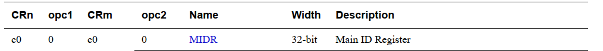
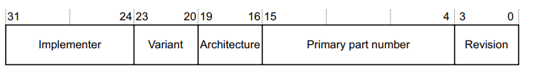

# 内核内存初始化-汇编阶段

在内核执行第一行代码之前，已经被 uboot 加载到物理内存中的，除此之外，在内核执行之前，uboot 已经准备好了内核运行所需要的环境：

* MMU = off，D-cache = off，I-cache = dont care。
* 在支持设备树的内核中，寄存器 r0 = 0，r1 = machine nr，r2 = dtb pointer，dtb 自然也已经被 uboot 加载到内存中
* 大部分的硬件设备已经被 uboot 初始化完成，包括基本的内存、时钟，外设接口串口、gpio等，在内核初始化前期可以使用这些设备作为调试手段。

实际上，嵌入式领域通常使用压缩的内核 zImage 或者 bzImage，这里的 z 前缀表示内核是被压缩的，因此内核镜像中首先执行的部分是解压缩代码，同时将内核镜像解压到正确的位置上，这种压缩对嵌入式领域来说是必要的，毕竟更小的内核镜像可以节省存储空间和减少传输时间成本。

解压缩代码对于内核而言是透明的，除了解压缩之外不会产生其它影响，MMU、cache、r0-r2 依旧保存着 uboot 传递过来的值。 

## 内核初始化汇编部分

stext 是内核代码的入口，实际上由于此时系统的其它硬件部分基本上已经初始化得七七八八了，内核初始化前期的汇编部分主要工作只有两部分：

* 获取板级相关的初始化参数。
  鉴于内核对各种架构的广泛支持，不同的硬件多多少少会有区别，内核将共同的部分抽象出来，其它的差异部分以参数的形式提供，硬件的区别分为几个层级，比如从处理器的层面来看，cortex-A7 和 cortexA9 同属于 armv7 指令集架构，大部分架构相关的程序都是可以通用的，而处理器之间的区别则提供一个 proc list 列表，根据实际情况选择不同的 proc list 列表。
  从 machine 的层面来说，不同厂商在同一处理器上的实现或者同一厂商生产的不同升级版本 machine，这些 board 在硬件上自然也是有差异的，因此这部分的区别体现在 machine info 上。
* 开启 MMU，当然，开启 MMU 并不仅仅是设置某个寄存器将 MMU 打开就行，MMU 的开启意味着物理世界到虚拟世界的切换，最核心的部分是页表的建立，这也是本文的重点。 

接下来，就深入到内核源码中，看看内核是如何启动以及开启 MMU 的。

在下面的分析中，只会在关键路径贴出相应的代码，毕竟按照我的过往经验，直接贴代码是没人看的，何况还是汇编代码，我们还是专注于分析代码背后的逻辑，内核代码时常会更新，但是其背后的设计思想变化不大。

内核可以通过配置选择编译为 thumb 指令集或者 arm 指令集，本文不分析 thumb 指令集的分支，毕竟我不熟...


## processor 相关的处理

在执行内核代码时，需要了解的两个前提是：

* MMU 还没有打开，也就是当前 CPU 直接面对物理内存，使用的是物理地址
* 通常情况下，内核镜像并没有加载到编译时指定的地址，内核在编译时，并不知道它将来要被加载到哪个物理地址上，所有代码都是按照虚拟地址进行编译的，MMU 开启之后自然是没问题的，但是 MMU 开启之前的代码很可能没有运行在正确的地址上，因此这部分代码只能是 PIC 的，也就是地址无关代码。

```assembly
ENTRY(stext)
	safe_svcmode_maskall r9                .........................1
	
	mrc	p15, 0, r9, c0, c0	               
	
	bl	__lookup_processor_type		       .........................2
	movs	r10, r5				
	beq	__error_p		
   
    adr	r3, 2f               
	ldmia	r3, {r4, r8}    
	sub	r4, r3, r4		
	add	r8, r8, r4		                    
2:	.long	.
	.long	PAGE_OFFSET                     ........................3
```

1. stext 是内核执行的第一条指令，这是在链接脚本中s使用 ENTRY() 关键字定义的，safe_svcmode_maskall 是一个汇编宏，接受一个寄存器参数，这里传入的是 r9，这里的 r9 并没有起到特别的作用，只是在程序处理过程中需要一个中间寄存器，毕竟这时候不能随便选择一个寄存器，有些寄存器是有特殊作用的
   safe_svcmode_maskall 所实现的功能很简单：
   一是确保经过处理后 CPU 处于 svc 模式下，这里会涉及到 hyp 模式的处理，不讨论。
   二是确保中断处于关闭状态，毕竟这时候中断向量表和中断控制器都还没有初始化，发生中断程序会跑丢

2. mrc 是一条协处理器寄存器的操作指令，表示将协处理器中的寄存器 copy 到通用寄存器中，通过指令中给出的 "c0, c0" 两个参数，再对比手册可以找到对应的寄存器：
   

   寄存器对应的字段内容为：

   
   这个寄存器提供 CPU 的 ID 信息，包括指令集架构、版本，这些版本信息被加载到通用寄存器 r9 中。

   因为 arm CPU 实现了 CPUID 机制，可以将 CPU 相关的 ID 识别信息直接写入到内部寄存器中，因此不再需要通过外部的参数传递。 

   接下来执行 __lookup_processor_type，从名称可以看出，这部分代码需要找到当前 cpu 所属的 arm 处理器类型(cortex-Ax)，通过处理器类型获取处理器相关联的 proc list 数据。

   因为这部分代码涉及到一些比较有意思的地址转换处理，有必要贴出代码分析分析：

   ```assembly
   __lookup_processor_type:
   	__lookup_processor_type:
   	adr	r3, __lookup_processor_type_data  // r3 赋值为地址,adr 指令是根据当前 pc 的偏移值
   	//r4=procinfo 的虚拟地址,r5=procinfo start,r6=procinfo end
   	//获取 procinfo 实际地址与虚拟地址之间的偏移值,r3 表示实际的运行物理地址,r4 是编译的虚拟地址(.这个地址定位符是在链接过程中解析的,而 adr 是根据当前运行的 pc 的偏移值)
   	ldmia	r3, {r4 - r6}     
   	sub	r3, r3, r4			  
   	add	r5, r5, r3			  //偏移值加上虚拟地址,才是真正的 procinfo 所在地址,保存到 r5
   	... 
   2:	ret	lr
   ENDPROC(__lookup_processor_type)
   ...
   
   __lookup_processor_type_data:
   	.long	.
   	.long	__proc_info_begin
   	.long	__proc_info_end
   	.size	__lookup_processor_type_data, . - __lookup_processor_type_data
   ```

   在这之前，r9 中已经保存了 MIDR 寄存器中的内容，这个寄存器可以帮我们识别当前 CPU 是哪个 arm 处理器平台。

   在上述的代码中，其它的一些不太重要的代码被我省略了，主要实现了获取内核镜像当前处理器相关的 procinfo 信息，问题在于：内核镜像在编译时尽管指定了 procinfo 的地址，但是那也是虚拟地址，而 procinfo 的实际地址取决于内核镜像被加载到哪个物理地址，那么怎么获得 procinfo 的内容呢？

   首先，通过查找内核代码可以发现，procinfo 是在 arch/arm/mm/proc-v7.S 中静态定义的，被放在 ".proc.info.init" 这个段中，同时，在链接脚本中使用两个变量 \_\_proc_info_begin 和 \_\_proc_info_end 分别指向该段的起始地址和结束地址，在链接阶段，分配的是从 0xc0000000 开始的某个虚拟地址上。

   也就是说，\_\_proc_info_begin 的值是 0xc0000000 + offset，这个 offset 就是静态定义的 procinfo 相对于内核镜像初始地址的偏移，不用管它是多少。而内核镜像并不是被加载到 0xc0000000 地址上，可能是地址 x 上，而这个 offset 是不变的。

   因此，procinfo 存放的实际地址应该是 \_\_proc_info_begin 减去一个真实物理地址的偏移值，那么，如何从代码上获取这个偏移值呢？

   这就涉及到汇编指令：adr，这条汇编指令用于获取指定符号相对于 pc 指针的偏移值，也就是和当前运行的地址相关，再看下面的代码：

   ```assembly
   adr	r3, __lookup_processor_type_data
   ...
   __lookup_processor_type_data:
   	.long	.
   	.long	__proc_info_begin
   	.long	__proc_info_end
   	.size	__lookup_processor_type_data, . - __lookup_processor_type_data
   ```

   "adr r3, __lookup_processor_type_data" 这条伪汇编指令将会生成类似于 "adr r3,\<offset\>"的指令，offset 就是   \_\_lookup_processor_type_data 相对于当前指令的实际地址。

   然后通过 ldr 指令取出 __lookup_processor_type_data 地址上保存的三个 long 型参数，"."是链接脚本中使用的地址定位符，表示 \_\_lookup_processor_type_data 编译时的指定的虚拟地址，r3 是物理地址，因此它们之间的偏移就是物理地址与虚拟地址之间的偏移值。 

   得到偏移值之后，就可以通过 __proc_info_begin 和偏移值计算得到 procinfo 所在的物理地址，保存在 r5 寄存器中。

   接着执行：

   ```
   movs r10, r5
   beq	__error_p	
   ```

   将 procinfo 的地址保存在 r10 寄存器中，如果 r5 为 0，也就是说没有找到对应的 procinfo，跳转到 __error_p 处执行错误处理

   

3.  为了避免频繁翻页，这部分代码就再贴上一遍：

   ```
   adr	r3, 2f               
   	ldmia	r3, {r4, r8}    
   	sub	r4, r3, r4		
   	add	r8, r8, r4		                    
   2:	.long	.
   	.long	PAGE_OFFSET    
   ```

   PAGE_OFFSET 宏是内核空间与用户空间地址的分界点，通常配置为 0xc0000000，这部分代码的作用在于，计算出内核对应的物理基地址，通常就是物理内存的起始地址。

   具体的计算方式和上文中提到的计算方式一样，也是使用  adr 指令得到标号物理地址，同时将其虚拟地址保存在对应的物理地址之上，其差值就是物理地址和虚拟地址的偏移值。最后将该值保存在 r8 寄存器中。 


## 页表相关的操作

内核经过上面的处理，目前所处的状态为：

```assembly
r0 = dont care
r1 = machine no
r2 = dtb pointer
r8 = phys_offset，也就是上面计算得到的物理基地址
r9 = cpuid 信息
r10 = procinf 物理基地址
```

接下来的内核处理为：

```assembly
bl	__vet_atags                      
...
bl	__create_page_tables
```

__vet_atags 用于检查传入的 dtb pointer 是否合法，编译生成的 dtb 头部会带有一个 4 字节的 dtb magic numer，如果是大端 CPU，这个 magic 是 0xd00dfeed，如果是小端 CPU，这个 magic 是 0xedfe0dd0。

为什么这个符号名为 __vet_atags，是因为在使用 dtb 传递参数之前，uboot 通过 atags 向内核传递参数，dtb 也就复用了 atags 的，同时，这部分代码同样支持 atags 的检查，uboot 同样可以使用老的 atags 接口替代 dtb，同时 uboot 传入的 r2 寄存器也要变成 atags 地址。

接下来的 __create_page_tables 就是内核启动汇编的核心部分：创建页表。

在前面的章节中(TODO)，我们对 armv7 的页表操作进行了比较详细的介绍，有兴趣的可以先参考这个文章，在这里再做一个简单的概念澄清：

* MMU 一旦打开，CPU 所有的内存访问都要先经过 MMU，执行虚拟地址到物理地址的翻译，再执行物理地址的访问
* 虚拟地址到物理地址的翻译基于页表，页表其实就是一张虚拟地址对应物理地址的映射表，页表需要软件上进行设定，按照硬件的要求保存(一个页表 block 需要保存在连续的物理地址上)，并将基地址设置到 CPU 内部寄存器中
* 软件上设定好页表后，地址的翻译工作由 MMU 自动完成，对虚拟地址的访问会由硬件自动映射为物理地址的访问
* 如果页表没有建立相应的映射，对虚拟地址的访问将会触发异常，在启动阶段，这种异常将直接导致程序无法继续运行


页表就是一个映射表，建立页表这项工作看起来并不难，问题在于，在执行当前的代码时，还不知道具体的物理内存分布，也就是对于内核而言，并不知道系统中有多少内存，或者说有几块内存，因为这些信息被保存在 dtb 中，现在还没有对 dtb 进行解析，当务之急是开启 MMU，只有开启 MMU 之后才算是进入了正常的世界。

目前只知道：

* 内核所在物理内存块的初始地址，保存在寄存器 r8 中。
* 内核代码相对于初始地址的偏移值，是在程序编译前就确定的一个宏：TEXT_OFFSET，arm32 中通常是 0x8000，也就是偏移地址为 32 K，前面保留的 32K 内存就是用来存放页表。


### 建立页表

接下来需要思考的问题是，既然不知道系统的总物理内存，无法建立完整的页表，那么我们需要为哪些虚拟地址建立页表？

首先自然是内核镜像，毕竟 MMU 开启之后，内核还需要继续运行。

dtb 所在的内存也需要建立页表，毕竟所有的内存信息都保存在 dtb 中，只有处理完 dtb 之后才能获得所有的物理内存信息，才能重新建立完整的页表。

还有一部分，就是开启 MMU 的代码，也需要建立相应的页表，开启 MMU 本身就是对一个寄存器的操作，只需要一条指令。可以假设以下的代码用来开启 MMU：

```
0x10000004  instruction1
0x10000008	enable_mmu
0x1000000c	instruction2
```

物理内存地址上 0x10000004 处的 instruction1 正欢快地执行，接下来一条指令将 MMU 开启，接下来执行 instruction2 时并不会直接从物理地址 0x1000000c 取代码，别忘了此时 MMU 已经打开，0x1000000c 摇身一变成了输出到 MMU 的虚拟地址，如果 0x1000000c 对应的虚拟地址没有相应的页表项，MMU 将会触发异常。

因此，通常情况是，开启 MMU 部分的代码会建立 虚拟地址=物理地址 的映射，也就是经过该页表的转换，最终的物理地址和虚拟地址是一样的，这样开启 MMU 之后的代码才更方便地继续运行。 

逻辑讲完了，我们再来分析源码：

#### 准备工作

在建立页表之前，目前所处的相关寄存器环境为：r8 = phys_offset, r9 = cpuid, r10 = procinfo。

__create_page_tables 的开始部分代码：

```
__create_page_tables:
pgtbl	r4, r8				
	mov	r0, r4
	mov	r3, #0
	add	r6, r0, #PG_DIR_SIZE
1:	str	r3, [r0], #4
	str	r3, [r0], #4
	str	r3, [r0], #4
	str	r3, [r0], #4
	teq	r0, r6
	bne	1b
```

pgtbl 是一段宏定义代码，主要的实现为：获取页表的基地址，这个基地址的计算方式为：物理基地址 + TEXT_OFFSET(32K) - PG_DIR_SIZE(16K)，也就是物理基地址的 16K 处，假设物理地址为：。


#### 内核页表的建立


