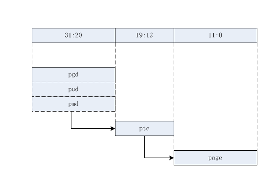
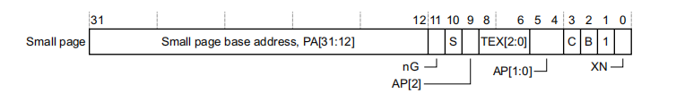
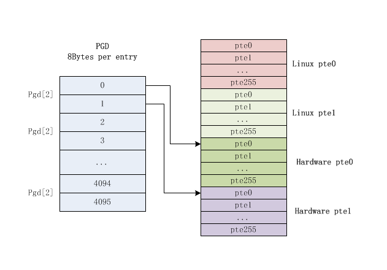

# 内存初始化 - 建立内核页表

在内核开启 MMU 之后，整个内存世界实际上还处于一片黑暗之中，毕竟这时候内核并不知道当前系统中物理内存的信息，只是为内核 image、dtb 建立了页表，内核只有访问这两部分才是安全的。

紧接着，memblock 内存分配器就开始工作了，这是内核中静态定义的一个内存管理器，其首要工作就是将所有问你内存纳入管理，首先从通过扫描 dtb 获取物理内存的相关信息，看清楚整个物理内存世界，然后将那些已经被使用的内存设为保留，比如内核镜像所在内存、dtb 内存、页表内存。至于其它的内存都是空闲可支配的。

但是，很可惜的是，由于其它空闲内存的页表没有建立，那些物理内存只能看到还不能摸到，因此，目前最紧急的任务就是建立物理内存的页表映射。 


## 内核页表的建立

首先，内核页表的基地址已经在此前确定了，为物理起始地址的 0x00004000 偏移处，占用 16K 的连续物理内存，将新建立的页表保存在该物理地址上即可，毕竟 MMU 要求内核给出的页表基地址为物理地址。 

实际上，起始地址偏移 0x00004000~0x00008000 这一段物理地址映射的是 4G 的内存，而内核只占用了最高 1G 内存，因此内核实际页表项的地址为 起始物理地址+0x00007000，不过设置到 MMU 的地址依旧是 0x00004000 偏移处。 

同时，内核中只有线性映射区才会直接建立页表，而对于高端内存是无法建立页表的，这并不难理解，假设物理内存有 1.5 G，已经超出了内核本身的线性空间，自然有一部分物理内存是无法建立直接映射的，关于内核中的内存区域 ZONE 的概念可以参考 TODO。

**有个不太好理解，但是非常重要的概念是：内核中线性映射区对于物理内存的映射仅仅是建立映射，内核可以直接访问这些内存，从而进行管理，而用户空间使用内存时建立的内存映射是基于内存分配的需求。**

**因此，对于用户空间而言，虚拟内存到物理内存的映射必须是分配大小的粒度，也就是 4K，但是内核中可以使用 section map，也就是 1M 的映射，这并不影响内核对物理内存的管理，分配时照样可以使用 4K 的粒度进行，毕竟 pfn 和 struct page 都是以 4K 页面进行索引的。**

内核中使用 section 映射的好处在于：

* 节省内存，不再需要分配二级页表项 block(一个 blcok 包含 256 项二级页表项)
* 节省内存访问时间，内存访问只需要翻译一次，不需要经过二级页表项的翻译

### pgd、pud、pmd、pte

对于 arm32 而言，硬件上就决定了可以使用一级页表(section map)或者二级页表(page table map)，对于 64 位系统而言，因为支持的线性内存空间巨大，需要使用 4 级页表，linux 为了兼容所有的硬件设备，因此内核统一支持 4 级页表(或者 5 级，还有一级 p4d 介于 pgd 和 pud 之间)：

* pgd：页全局目录
* pud：页上级目录
* pmd：页中间目录
* pte：页表项入口

对于不同级别的页目录(entry)，对应内核中不同的数据类型：

```c++
typedef u32 pmdval_t;
typedef pteval_t pte_t;
typedef pmdval_t pmd_t;
typedef pmdval_t pgd_t[2];
typedef pteval_t pgprot_t;
```

尽管其中有些类型是一致的，定义不同数据类型的好处在于

* 页表层次从名称中得到体现，避免操作时的混淆，方便阅读代码
* 实现抽象化的代码，对于不同的架构而言，页表的硬件实现通常会有一些大大小小的区别，软件的 driver 部分代码自然不能对每种情况进行区分处理，更好的方式是针对某个统一的对象进行操作，比如程序需要操作 pmd 时，传入的参数为 pmd_t 而不是实际的 u32，而对于不同的架构而言，pmd 可以根据硬件特性使用不同的类型，这样就可以统一 driver 的实现。

对于 arm32 而言，并不需要使用到 pud 和 pmd，直接让 pgd 目录项指向 pte 即可，将 pud 和 pmd 折叠，做法就是直接让 pud 和 pmd 指向 pgd，这种折叠并没有太多成本，只是在创建页表的时候多两层函数调用而已。 

大体上对应的结构为(粗略图)：



### 硬件页表与内核页表

在 TODO 这篇博客中介绍到，armv7 规定在实现 4K page table map 时，二级页表项为 256 项，每项占用 4 bytes，一个二级页表 block 占用 1K 的空间，但是问题在于页面大小为 4K，因此需要多个二级页表 block 存放到一个 page 中，以免造成内存的浪费。理论上一个 page 中可以存放 4 个二级页表 block。

实际情况并不是这样，由于 armv7 处理器设计的特殊性

实际情况是，对于防止二级页表 block 的页面，每个页面只会存放两个二级页表 block，这是硬件页表 block，剩下的 2K 空间存放的是内核页表 block，那么，为什么 arm 内核会需要两个页表block？

在 x86 架构 MMU 的 page table entry 中，有三个标志位是硬件规定的：

* PTE_DIRTY：页面 dirty 位，CPU 对页面执行写操作时会将该页面的 dirty 位置位，说明页面被修改，是脏页。
* PTE_YOUNG：MMU 寻址时会对页面的该标志位置位，该标志位被置位的的页面说明在不久前被使用过，因此在页面换出的时候不会考虑该页
* PTE_PRESENT：用于判断页面是否在内存中。

由于 linux 最早是在 x86 平台上运行的，因此内存管理也就继承自 x86 的架构。但是在 armv7 对于页表的规定中，二级页表项中并不包含这些重要的标志位，因此，硬件的缺失需要通过软件来实现。

解决方案是：对应所有的二级页表 block，提供两份，一份给硬件用于 MMU 地址翻译，而另一份给 linux 内核，用于软件模拟上述标志位，其硬件规定的二级页表项为：



高 20 bits 用于物理寻址，低 12 bits 则是内存标志位(参考TODO)，对于 linux 软件页表而言，高 20 bits 相同，而低 12 bits 用于 pte_dirty、pte_young 等标志位，这些标志位被定义在 arch/arm/include/asm/pgtable-2level.h 中：

```c++
#define L_PTE_VALID		(_AT(pteval_t, 1) << 0)		/* Valid */
#define L_PTE_PRESENT		(_AT(pteval_t, 1) << 0)
#define L_PTE_YOUNG		(_AT(pteval_t, 1) << 1)
#define L_PTE_DIRTY		(_AT(pteval_t, 1) << 6)
#define L_PTE_RDONLY		(_AT(pteval_t, 1) << 7)
#define L_PTE_USER		(_AT(pteval_t, 1) << 8)
#define L_PTE_XN		(_AT(pteval_t, 1) << 9)
#define L_PTE_SHARED		(_AT(pteval_t, 1) << 10)	
#define L_PTE_NONE		(_AT(pteval_t, 1) << 11)
```

那么，软件上是如何模拟这些 x86 中的硬件标志位的呢？

* PTE_DIRTY：对于新分配的页面，先将其映射为只读，当对该页面执行写操作时，会触发 MMU fault，在异常处理程序中将标志位进行修改
* PTE_YOUNG：在页面分配的时候被置位，解除映射的时候清除
* PTE_PRESENT：其实一个虚拟页面有没有在内存中有两种情况，一种是页面压根就没被分配，另一种是被换出了，如果页面是被换出的，那么 PTE_YOUNG 会被置位，而 PTE_PRESENT 会被清除，如果是压根没有分配，两个标志位都为 0。


对于一个装有二级页表 block 的 page，它的布局为：



从上面的分析不难看出，linux 软件实现的页表和 arm 中硬件定义的页表是有差别的，严格来说 linux 软件在硬件页表的基础上进行了一些调整，主要为以下几点：

* linux 内核为了兼容各种体系架构，使用了 4(5) 级页表，当然 arm 实际上使用了其中两级。

* armv7 MMU 硬件上不支持 dirty、young 等标志位，但是内核内存管理框架需要应用这些标志，因此在软件上对每一个页表项需要额外增加模拟二级页表项

* 鉴于 arm 硬件定义的二级页表 block 为 256 项，每项 4 bytes，占用 1K，加上软件模拟页表项为 2K，但是一个最小的页面为 4K，因此需要将 4 个二级页表 block(2个linux 软件模拟 pte block + 2个硬件 pte block) 放到一个页面中，每个 PGD 项实际上是占用 8 bytes，因此有以下定义：

  ```c++
  #define PMD_SHIFT		21
  #define PGDIR_SHIFT		21
  
  #define PMD_SIZE		(1UL << PMD_SHIFT)
  #define PMD_MASK		(~(PMD_SIZE-1))
  #define PGDIR_SIZE		(1UL << PGDIR_SHIFT)
  #define PGDIR_MASK		(~(PGDIR_SIZE-1))
  ```

   PMD_SIZE 被定义为一个 PMD 能够映射的内存大小，PMD_SIZE = 1 << 21 = 2M。

  从硬件定义来看，每个 pte block 应该是 1M，SHIFT 值应该是 20，但是软件上的处理为：将两个 pte block 放在一个页面中，因此每个 PGD 占用 8 bytes，而 PMD = PGD，因此 PMD 也就相当于两个 pte block，两个页面也就是 2M，SHIFT 为 21。


### 建立映射

内核线性映射内存区映射的建立在  paging_init -> map_lowmem 函数中，对于所有的空闲内存，默认映射为 RW 属性，而对于内核而言，需要加上 X 属性，不然内核代码无法执行，尽管内核在开启 MMU 的阶段已经映射过了，但是那毕竟只是在不知道物理内存信息的情况下建立的临时映射，因此内核需要重新映射为 RWX 属性，而 dtb 占用的内存也是 RW 属性，和空闲内存一起做映射即可。

因此，内核线性空间的映射通常被分为三个部分：

* 内核镜像之前的物理内存映射，RW 属性
* 内核镜像的重新映射，RWX 属性
* 内核镜像之后的物理内存映射，RW 属性

在 map_lowmem 函数中，先是对上面所提到的三个内存区域空间进行计算，然后分别映射，建立内存映射的函数为 create_mapping，该函数接受一个 struct map_desc 类型的参数：

```c++
struct map_desc {
	unsigned long virtual;
	unsigned long pfn;
	unsigned long length;
	unsigned int type;
};
```

这个参数非常好理解，既然是虚拟内存到物理页面的映射，自然包括虚拟内存地址、物理页面页帧号 pfn，映射长度以及映射类型。 

create_mapping 函数实现为：

```c++
static void __init create_mapping(struct map_desc *md)
{
	...
	__create_mapping(&init_mm, md, early_alloc, false);
}
```

create_mapping 函数就是对 \_\_create_mapping 函数的封装，\_\_create_mapping 的几个参数得聊一聊：

* init_mm：在前面的章节(TODO)提到过，尽管内核初始化早期调度子系统没有就绪，但是内核静态定义了一个 init 进程，内核初始化流程就是运行在该进程中，对于任何进程都会有其对应的一份页表，这个页表只是 pgd block，保存所有的 pgd，而所有的 pte block 是按需动态分配的。
  因此，task struct 结构中保存了页表基地址，具体成员为 task->mm->pgd，对于 init 进程而言，其 struct_mm 结构也是静态定义的，因此 \_\_create_mapping 第一个参数需要提供进程的 mm 结构，实际上主要是提供当前进程的 pgd 首地址。
* md： struct map_desc ，包括建立映射需要的几个关键参数，见上文。
* early_alloc：内存分配接口，如果是 page table 映射，使用二级页表，那么对应的二级 pte block 就需要动态分配内存，early_alloc 底层调用的还是 memblock 的内存分配接口，毕竟这时候 buddy 子系统还没有初始化完成。
* ng： \_\_create_mapping 传入的第四个参数为 false，这个参数实际对应 ng 标志位，这个标志位的作用在 armv7 手册中被定义的(也就是硬件决定的)，为 not  global bit，如果该标志为 false，表示页表是对所有 processor 可见的，如果为 true，表示页表只对特定的 processor 可见。


linux内核页表：https://blog.csdn.net/zf1575192187/article/details/105207086