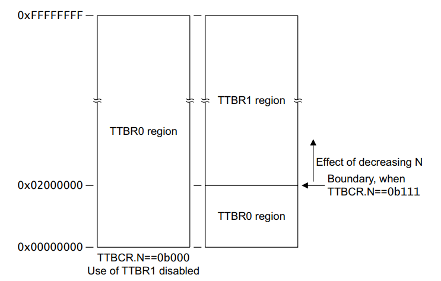

## 内存管理子系统的职能

* 虚拟地址到物理内存地址之间的映射
* 内存的分配

需要搞清楚的点：

* linux 内存的初始化，页表的建立，页到内存到底是什么关系？
* 进程对应的内存映射
* linux 内存的分配

先搞清楚页表是怎么来的。

为什么要分页?

1.页相关信息可以分散存储.

2.用到的虚拟页才分配数据结构,这样可以节省内存.

劣势在于需要多一次访问内存,不分页只要访问两次,分页需要访问三次. 

参考:https://blog.csdn.net/ibless/article/details/81275009

arm VMSA 相关知识点.

first level descriptor

 

Domain:domain 域.见 B3-1358.

SBZ : Should Be Zero 的简写,也就是这位没有意义.

PXN : 通常实现了 PAE(大物理内存地址扩展) 的架构才需要使用这个 位.如果支持,该位决定了处理器是否可以以 PL1 模式执行该区域的代码.

NS : Nonsecure bit,一般的 guest os 代码不会运行在  secure 模式下.

---

second level descriptor 

nG:  not global bit, 在地址翻译时决定了 TLB 的缓存行为.

S : Shared bit,决定该地址区域是否是 share 类型的区域.

AP[2],AP[1:0] : 访问权限控制位,access permissions

TEX[2:0],B,C :内存访问属性

XN : Execute-never ,表示该位置的数据能不能被当成代码执行.

---

TTBR1(页表基地址) 的寄存器映射

TTBR0(页表基地址) 的寄存器映射,其中 x 为 TTBCR.N

TTBR0 和 TTBR1 是两套不同的寄存器设置,通过 TTBCR.N 决定如何使用,如果该配置为 0b000,表示不使用 TTBR1,只使用 TTBR0 描述整个内存空间,通过配置 TTBCR.N 可以设置 TTBR0 和 TTBR1 指定的位置,比如分别记录用户空间和内核空间.

实际的 arm-linux 中,只使用了 TTBR0,并没有使用 TTBR1.

---

TTBCR(基地址控制) 寄存器

对于不支持安全扩展的实现,PD0/PD1 无意义.主要是 bit0~bit2 的 N 位.

4K 页面寻址流程图:

