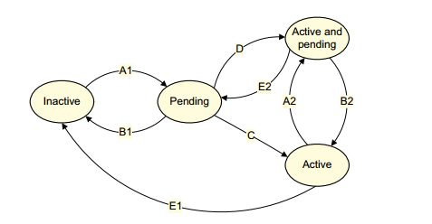

# arm-gic 驱动
即使是一个简单的嵌入式系统,通常也支持多种类型的中断,比如 uart/DMA 等,而对于 arm 架构的 CPU 而言,硬件上只有两根低电平触发的中断线:IRQ 和 FIQ,对于 linux 而言,并没有使用 FIQ,而只是使用了 IRQ 一根中断线接收并处理中断请求.  

因此,多个外设中断与 CPU IRQ 中断线之间的桥梁就是中断控制器,对于 arm 处理器,arm 提供了专属的 arm 中断控制器,即 GIC.  

## gic 需要处理的问题
gic 主要的工作就是两个部分:
* 接收外设传递过来的中断
* 将外设中断传递给 CPU

抽象地描述总是很简单的,背后的实现却并不简单,这主要涉及到几个问题:
* 外部中断的数量非常多,如何对数量繁多的外部中断进行管理,解决中断的排序以及并发问题?
* 在多核架构中,CPU 的数量也不止一个,如何将多个中断分发给不同的 CPU?
* 每个 CPU 只有一个物理的 IRQ 引脚,对于 CPU 而言,触发中断也就是 IRQ 被拉低,但是它是不知道是目前触发的中断是哪一个外部中断的,如何让 CPU 识别并处理外部中断.  

## 硬件架构
还是那句老话,软件框架是基于硬件结构进行抽象的,在了解 gic 之前,有必要先了解 gic 在系统中所处的位置,下面是 cortex-A7 的硬件结构图:TODO

cortex-A7 是一个 4 核结构，具体的实现也可以是单核，不难从硬件结构图中看到，GIC 是所有 CPU 核心共享的器件，接收处理器外部(通常是外部)的中断信号，通过 SCU 单元将中断信息传递给各个 CPU 核，准确地说应该是各个 CPU 可以通过总线接口访问 gic，因为这是整个 cortex-A7 MPcore 的框图，并不针对 GIC，实际上 GIC 还有硬件的 IRQ 和 FIQ 信号连接到 GIC 上，GIC 通过硬件上的 IRQ/FIQ 传递中断信息。  

而具体中断相关的系统框图可以参考下面:TODO.  

首先,中断是一种硬件信号,因此 gic 针对每个存在的外部中断都提供了一个硬件控制引脚,当外部设备发生中断时,通过这个硬件上的引脚传递中断,同时中断控制器通过不同的引脚来区分发生中断的硬件.  

对于 CPU 端,接口分为两部分:
一个是去到 CPU 的硬件中断线,IRQ 或者 FIQ,vIRQ/vFIQ 是虚拟化扩展的部分,暂不讨论.  

另一个是系统总线,CPU 通过系统总线访问 gic 的内部寄存器,因此,gic 也是一个 memory map 类型的设备.尽管它和 uart 这些外设一样都是通过系统总线进行访问,但是 gic 是处理器内部实现的.  

所体现出来的区别就是,针对多核架构,gic 可以实现 bank 寄存器,bank 寄存器的概念在 CPU 体系架构中经常见到,也就是一个地址上对应多个寄存器的副本,比如对于在 0x800 地址上的寄存器,CPU0 和 CPU1 对这个地址上寄存器的访问结果是不同的，是各自的寄存器,至于 gic 如何识别当前是哪个 CPU 在访问当前寄存器,这是由硬件进行识别的,处理器内部的 gic 提供该功能,而处理器之外的外设(比如uart)是不支持的.   


## gicv2
arm 的 gic 有多个版本，最初的版本是 gicv1，这个版本拥有 gic 的大部分核心功能，包括中断分发、中断使能控制、优先级控制以及对多核的支持等等。gicv2 在 gicv1 的基础上增加了虚拟化扩展、中断分组、wakeup event 等功能，v3 版本增加了中断源数量和 CPU core 的支持，而 v4 进一步加强了对虚拟化的支持，v3 和 v4 主要针对 armv8 架构，通常应用在 cortex-A53/A57/A72 上。  

鉴于 gicv2 版本基本上已经包含了 gic 的大部分核心功能，同时我们也不关心虚拟化相关的内容，因此主要对 gicv2 进行介绍和分析。  

gicv2 是一个 gic 标准，按照惯例，标准只是规定了在具体的实现中哪些核心的部分需要符合规范，而哪些部分是可以由实现自由发挥的，针对 gicv2 标准的实现有 GIC-400 以及各个处理器中的实现。  

同时，gicv2 的实现针对的是整个 arm 硬件平台，并不针对硬件平台上的软件或者操作系统，对于不同的操作系统又存在不同的应用，比如 linux 中并不使用到 arm CPU 的 FIQ 中断，因此，针对 gic 以及其实现的分析，我们主要基于 linux 平台的实现，抛开诸如安全扩展、虚拟化扩展、FIQ 中断抢占等和 linux 不相关的内容。  


## gicv2 结构
正如上面所提到的,GIC 对下连接各路中断源,对上输出到 CPU,GIC 的硬件设计也分成相应的两部分:
* GIC distributor
* GIC CPU interface

distributor 翻译过来就是分发器,负责将中断源传递过来的中断进行分发,而 CPU interface 不言而喻,则是针对 CPU 的配置接口,在多核架构中,每个 CPU 对应一个 CPU interface,负责将 distributor 传递过来的中断传递给 CPU,同时和 CPU 进行系列的交互.因此,在 GIC 中,一个外部中断向上传递的流程为:中断产生源 -> GIC distributor -> GIC CPU interface -> CPU.   

下面是 GIC 内部的硬件框图(TODO):


在上文对中断源的描述中,只提到了外部中断,因为这是底层开发人员最熟悉,也是接触的最多的中断源,在 GIC 中称为 SPI,即 Shared Peripheral Interrupt(注意和 SPI 通信协议的区分),是所有 CPU 共享的中断,处理器外部的外设通常使用这些中断,比如 uart/i2c.  

有共享中断,那就有私有中断,私有中断有两种:
* Private Peripheral Interrupt (PPI):这些中断也对应硬件上的外设中断线,只不过这些中断是会被分发到指定的 CPU.  
* Software-generated interrupt (SGI):这是软件上配置的中断,这类型中断的触发是通过软件上写 gic 的寄存器实现的,同时这类中断也是指定 CPU 的.  

因此,在上面的硬件框图中,SPI 是共享的,而 SGI 和 PPI 是 percpu 类型的,而 SPI/PPI 具体连接哪些中断,由具体的实现来决定.  

### distributor
GIC 中的 distributor 是属于所有 CPU 共享的,主要控制中断的收集与分发,其具体实现的接口为:
* 全局地控制是否将中断源传递到 CPU interface.
* 控制单个中断线是否使能,如果不使能,对应中断线上产生的中断自然不会传递到 CPU interface.
* 设置每个中断的优先级,当出现中断源的并发时,向 CPU interface 传递优先级更高的中断
* 设置所有中断源传递的目标 CPU,可以指定某些中断只传递到特定的 CPU interface.
* 设置中断触发模式,是电平触发还是边沿触发
* 为每个中断配置为 Group0 或者 Group1,通常只有在实现了 secure 模式的处理器上才会区分 Group0 或者 Group1
* 传递 SGI 到特定的 CPU 核,可以是单个,也可以是多个.  
* 软件可以直接设置和清除外部中断的 pending bit,也就是软件也可以触发外部中断.  

#### 中断号
对于 GICv2,最多支持 1020 个中断源,这是规定的一个上限值,具体的数量需要看处理器以及 board 的实现,比如 cortex-A7 处理器中实现的 gic 只支持 480 个 SPI 中断,而实际基于 cortex-A7 实现的 imx6 只是使用了 128 个外设中断线.  

在标准的规定中,每个中断都对应一个 ID 号,ID0-ID15 用于 SGI 中断,ID16-ID31 用于 PPI 中断,而 ID32- 1019 属于共享的 SPI 中断.  

在多核中,对于硬件上的 PPI 中断,由 GIC 的 bank 寄存器控制,每个 PPI 线都只会对应一个特定的 CPU,PPI 对应哪些中断这是由处理器决定的,比如对于 cortex-A7 而言,PPI1 对应 Secure Physical Timer event,PPI2 对应 percpu 的 Non-secure Physical Timer event,从硬件上来说,每个 CPU 都有各自独立的 timer 硬件，这些 timer 的中断输出引脚都会连接到 GIC 上，当 timer 的中断产生了， GIC 会将 timer 传递过来的硬件中断信号路由到指定的 CPU interface，而不会将 timer 中断传递给别的 CPU，这些操作都是由硬件完成的。  

对于 SGI 而言，是通过软件上写寄存器 GICD_SGIR，通过指定需要发送的 CPU mask 和 intnum 来向单个或者多个 CPU 发送中断信号。  

0~1019 总共 1020 个中断号定义的是常规的中断号，而 1020-1023 这几个是 gic 定义的特殊 ID，这几个 ID 中目前只有 1023 被用于指示当前没有 pending 中断的返回值，一般来说，在中断处理操作中，会循环地遍历中断源以查看是否有 pending 状态的中断并处理，如果没有，pending 寄存器返回 1023 中断 ID(不能使用常规的 0，因为它是有效的 ID)。  


### CPU interface
对于每个连接到 GIC 的 CPU 核，都会存在一个对应的 CPU interface，它主要提供以下的接口：
* 是否将中断信号发送给 CPU 中断引脚的 enable 控制。
* ack 一个中断信号
* 标识某个中断处理的完成
* 设置中断的优先级
* 确定最高优先级的中断并将其传递给 CPU 核
* 定义中断抢占的策略

在中断发生时，distributor 根据 target CPU mask 的设置将中断发送给指定的 CPU interface，此时的 CPU interface 并不会直接将中断传递给 CPU，一方面，该中断号需要被使能，再者，该中断源需要具有足够的优先级。当 CPU 并没有在处理中断时，这时候优先级自然是最低的，一旦 CPU 正在处理中断时,优先级就变成了正在处理中断的优先级，如果该优先级比正在处理的优先级高，那么就可以根据中断的抢占策略决定是否让当前中断抢占之前的中断。  

在 linux 中，没有使用 FIQ 中断信号，并不支持中断的抢占，因此，中断的执行都是顺序的，或者说即使在 CPU 执行中断的过程中 gic 重新发送了更高优先级的中断信号，CPU 也并不会处理，因为 linux 在中断处理中屏蔽了中断。  

## 中断状态的切换
中断信号从中断源产生到最后 CPU 处理完成，这个过程并不是一蹴而就的，而是经过了 distributor 和 CPU interface 的处理，因此，对应每一次处理，需要记录该中断源当前的状态来识别和控制，每个中断的状态由 distributor 维护，中断源的状态分为几种：

* inactive：中断没有被触发，也没有正在被 CPU 处理

* pending：中断处于触发状态，还没有被处理。 
*  active：表示 CPU 正在处理的中断源
* active and pending：表示 CPU 正在处理的中断源，同时该中断源保持触发中断的电平


中断状态的切换可以参考下图(TODO)：




* A1、A2：中断的 pending，对于 SGI 而言，软件上可以通过写 GICD_SGIR 和 GICD_SPENDSGIRn  寄存器产生中断信号，而对于 PPI 而言，最常见的就是当外部设备产生中断信号并传递到 GIC 时，这时候该中断处于 pending 状态，同时，软件上还可以通过写 GICD_ISPENDRn  寄存器来触发一个中断，是的，你没看错，外设中断也可以通过软件触发，只是一般很少这么做。

* B1、B2：清除中断的 pending bit，对于 SGI 和 PPI，软件上写 GICD_CPENDSGIRn  和 GICD_ICPENDRn   就可以清除 pending 标志位，而清除标志位的时机是由具体实现确定的，比如初始化或者 CPU ack 中断时。

* C：从 pending 到 active， 当一个中断被 CPU interface 发送到 CPU 时，进入中断处理，CPU 需要通过读取 GICC_IAR 获取当前处理的中断 ID，CPU 读取这个寄存器时，该中断的状态就由 pending 切换到了 active。

* D：从 pending 到 active and pending，对于 SGI，当 CPU 执行完上一条 C 的流程之后，几乎同时软件上又重新触发了该 SGI 中断，另一种情况是当两个或以上的相同的 SGI 被软件上同时触发，第一个 SGI 会走上面的 C 流程，而第二个触发会导致中断从 pending 到 active 的切换，也就是软件上的重复中断并不会丢失。

  对于 SPI 或者 PPI 情况就不一样了，这两种是硬件触发的中断，当中断源是电平触发的中断时，CPU ack 了一个中断源，该中断状态切换为 active ，但是外设的中断引脚并没有解除触发状态，这种情况很常见，因为外设的实现可能是 CPU 如果没有处理中断就不会解除电平触发状态，通常会在用户自定义的中断处理程序中解除中断状态，因此也就直接从 pending 切换到了 active and pending 状态，对于边沿触发的中断，一般几乎是 pending  到 active 的同时再次触发了中断，如果这中间的间隔时间比较长，也就是先后执行 C 和 A2 的过程。 

  不同于 SGI 中断，SPI 和 PPI 硬件中断会丢失重复的待处理中断，这也不难理解，电平和 pending 状态的表示是一个二义值，无论是硬件上还是软件上都无法记录重复的中断触发。 

* E1、E2：active 状态的清除，当 CPU 处理完中断时，会写寄存器 GICC_EOIR 或 GICC_DIR deactivate 中断，清除中断 active 的状态，同时降低当前执行中断的优先级。


## 中断的优先级

在 distributor 和 CPU interface 中都存在中断优先级的概念，高优先级的中断信号自然是优先处理，优先处理分为两种概念，一种是抢占优先，高优先级的中断可以直接抢占低优先级中断执行，另一种是并发的优先级，也就是当两个中断同时触发时，才会使用根据优先级来判断谁先执行，而如果低优先级中断正在处理，也只能等着。  

在 gic 中，优先级由 8 位表示，总共 256 个等级，具体的实现可以不使用这么多，最少可以使用 4 bits 来表示，即 16 个优先级，优先级值的 value 越低，对应的执行优先级越高，因此，优先级为 0 总是表示最高优先级的中断，而最低优先级对应的 value，根据使用的优先级 bits 而定。  

在 gic 中，存在两种类型的优先级，一种就是上面说的每个中断源都可配置为一个静态的中断优先级(由 distributor 管理)，这个优先级可通过软件动态地修改，另一种是 CPU interface 的 runtime 优先级，即当前正在处理的优先级，当前中断的优先级高于正在处理的优先级时，中断才会将当前中断发送到 CPU 核，不同优先级的中断之间可以配置抢占，也就是在 CPU 正在处理低优先级中断时，再次发送一个高优先级中断，不过发送归发送，具体的实现中 CPU 是不是会受理该新的中断，根据实现而定，比如 linux 中，即使配置 gic 支持抢占，也会因为 linux 处理中断时会关闭中断而禁止中断的抢占。  


## 中断上报流程

上文中对 gic 的各个部分进行了讲解，最重要的还是对整个 gic 处理中断时的流程进行一个详细的梳理，这样才能对 gic 建立一个完整的概念，以一个常见的低电平触发的中断为例，下面是一个中断的完整上报流程：

* 外设产生中断，拉低连接到 gic 的中断线，gic 中对应中断线的 pending bit 被置位，表示中断产生，这是 gic 的硬件自动完成的。 

* 如果该中断和全局中断传递使能，distributor 根据该中断设置的 CPU mask 将中断传递到对应的单个或多个 CPU interface，一般来说，只会将中断传递给一个 CPU 处理，如果为一个中断设置多个 target CPU，中断源的触发会导致多个 CPU 的 IRQ 引脚被拉低从而进入中断模式，实际上又只会有一个 CPU 处理该中断。但是在 GIC 手册中，是支持这种做法的，也就是一个中断源配置多个 target CPU，第一个 CPU ack 了该中断之后，后续的 CPU 查询中断 ID 寄存器返回无效的中断号 1023，退出中断处理，尽管我暂时没见过哪些中断需要这么干，但这种做法确实是被允许的。 
  如果存在多个中断，distributor 会将最高优先级的中断发送给 CPU interface

* CPU interface 决定是否将中断发送给 CPU 核，也就是触发对应 CPU 的 irq 引脚，取决于中断传递是否使能以及中断是否有足够的优先级，如果 CPU 当前没有正在处理中断，自然是可以传递的，如果 CPU 正在处理中断，那就看新中断的优先级是否更高同时还取决于是否配置了中断的抢占。  

* 在  arm linux 中，CPU interface 将中断信号传递给 CPU，实际上就是 assert CPU 的 IRQ 中断线，如果 CPU 没有屏蔽 irq 中断线，就会跳转到中断模式，处理中断，经过一系列的现场保存工作等准备工作之后，CPU 会读取 GICC_IAR   寄存器获取中断 ID，读这个寄存器也意味着 CPU ack 了该中断，该中断在 gic 中记录的状态切换为 active and pending，因为即使 CPU ack 了中断，当前中断线的电平并没有被拉高，还是处于触发状态。 如果是边沿触发的中断，在 CPU ack 了之后，就会切换为 active 状态。  

* 系统的中断代码会调用到用户自定义的中断处理程序，在自定义处理程序中，用户需要将该外部中断 deassert，也就是将中断线重新置为高，该 gic 的状态也就从 active and peding 切换为 active，如果没有这一个步骤，中断会被反复触发。

* 中断处理完之后就是收尾工作，在这阶段，CPU 需要告诉 GIC 当前中断的处理已经完成，把当前中断源状态设置为 inactive，同时将 CPU interface 的优先级降低，linux 内核中也会重新开启中断(操作 CPSR 的 i bit)，gic 也就可以重新发送其它的 pending 中断到 CPU 上了。

  

  

这是一个 SPI 中断的处理流程，对于 SGI 来说，不同之处在于：

* 中断是软件触发的，通过向对应的寄存器中写入需要触发的中断号(0-15)以及对应的 CPU ID。
* distributor 并不再需要通过读取 CPU mask 寄存器来决定该中断需要发送给哪个 CPU，SGI 的 target CPU 在触发中断时已经决定了
* SGI 中断可以发送给多个 CPU，而且经常作为 CPU 之间通信的方式，各个 CPU 之间处理 SGI 中断是独立的，比如对于 8 号 SGI 中断，每个 CPU 都可以独立处理，而且在处理的过程中，每个 CPU 对应该中断的中断状态也是独立的。  


## 中断的 completion 通知

当 CPU 中断处理完之后，需要将中断处理完的消息通知 GIC，这个消息通知包含两个部分：

* 降低 CPU interface 的上报优先级
* deactivate 处理完的中断，切换中断的状态

在具体的实现中，这两个过程可配置为统一操作和分开操作的模式，由寄存器 GICC_CTLR 的 EOI 配置位进行配置，在 GIC 中被称为 EOI(end of interrupt) mode，当 EOI mode 被使能时，写寄存器 GICC_EOIR  将会触发中断的 priority drop，而 deactivate 操作需要通过写 GICC_DIR   寄存器实现，当 EOI mode 被 disable 时，直接写 GICC_EOIR 将会同时触发 priority drop 和中断的 deactivate。   


## GIC 的级联

嵌入式系统中，通常一个 gic 足以管理所有的外部中断，但是在某些复杂的系统中，可能一个 GIC 并不够，非常容易想到的一个扩展方案就是增加 GIC 的数量，并列地增加 GIC 并不是一个好方案，比如两个 GIC 的中断输出同时连到 CPU 的 IRQ 上，这会带来一些识别上的额外工作，于是多个 GIC 之间采用级联的方式。  

在 GIC 级联的方案中，root GIC 作为主要的中断控制器，其中断输出引脚直接连接到 CPU 的 IRQ 引脚，而随后的 GIC 作为子 GIC，其输出引脚连接到 root GIC 的某个外部中断引脚上，于是这类 GIC 就有了两重身份：一方面，它作为 GIC 接收和分发连接在该 GIC 上的外部中断源，另一方面，它又跟其它的外设中断设备一样，将中断信号发送给 root GIC。   

硬件是一方面，主要的部分还是软件，在中断的软件处理中，一个非常重要的部分就是需要确定目前发生中断的是哪个中断，体现在软件中就是中断号，这个中断号是逻辑上的，它并不一定和硬件上 GIC 中的 ID 号相对应，然后再调用对应中断的 handle 回调函数。  

在没有 GIC 级联的情况下，中断 ID 的映射逻辑还是很简单的，只需要做一个线性映射表就可以了，甚至直接使用 GIC 的中断 ID 也没什么问题，特殊的情况下，硬件上 GIC 上连接的中断源也可能不是连续的，这种情况下的处理也不会太复杂。  

引入级联的中断之后，GIC 硬件中的 ID 号和软件上使用的逻辑中断号的关系就不再那么简单了，每个 GIC 都有对应的 0-1020 个中断 ID，从需求上来看，软件上对针对中断号的需求无非就是要为每个中断源分配并维护一个唯一的 ID 号，而硬件 ID(也就是 GID 中的中断 ID)是固定的。  

只有一个 root GIC 的时候只需要提供硬件 ID 号即可找到对应的软件中断号，级联的 GIC 就做不到了，需要提供两个参数：一个是该中断属于哪个 GIC，另一个参数是对应该 GIC 的哪个中断 ID。  

由此，为了更好地管理 GIC 的级联关系，软件上抽象出了 GIC domain 的概念，也就是为不同等级的 GIC 划分域，root GIC 作为一个 域，而 secondary GIC 为另一个域，将 GIC 根据层级进行划分，更方便管理。  

假设系统中存在两个级联的 GIC，一个 root GIC0，一个 secondary GIC1 连接在 root GIC 的 40 号中断上，当 GIC1 上的中断发生时，会先将中断传递到 GIC0 的 40 号中断，在不久后再传递到 CPU 的 IRQ 中断线，CPU 由此进入到中断处理例程中，CPU 分别进入到这两层 domain 中，并通过 domain 中的映射关系找到产生中断的硬件，以及其对应的逻辑上的中断号，再调用对应的中断处理函数。  

至于 domain 是如何建立以及被使用的，后续我们再对 GIC 的驱动进行分析。  


# GIC 驱动源码分析

GIC 通常是集成在处理器内部的一个硬件设备，既然是硬件设备，自然就可以在设备树中找到相关的信息：


```c++
intc: interrupt-controller@00a01000 {
		compatible = "arm,cortex-a7-gic";
		#interrupt-cells = <3>;
		interrupt-controller;
		reg = <0x00a01000 0x1000>,
		      <0x00a02000 0x100>;
	};
```


上述的示例是 cortex-A7 中的 GIC 的实现，其中 interrupt-controller 属性表示当前节点是一个中断控制器节点，而 reg 中断的两组内存描述分别对应 distributor 和 CPU interface 的外设地址，在多核的情况下，这两个外设地址可能是 bank 类型的，有些 gic 的实现并不支持 bank 寄存器，这时候就要提供另一个属性："cpu-offset"，为每个 CPU 指定一个 offset，对应不同的 distributor/CPU interface 寄存器地址，大部分的实现都是支持 bank 寄存器的。


按照惯例，通过 "arm,cortex-a7-gic" 找到对应的驱动程序，在 drivers/irqchip/irq-gic.c 中，可以找到对应的 driver 定义：

```c++
...
IRQCHIP_DECLARE(cortex_a9_gic, "arm,cortex-a9-gic", gic_of_init);
IRQCHIP_DECLARE(cortex_a7_gic, "arm,cortex-a7-gic", gic_of_init);
IRQCHIP_DECLARE(msm_8660_qgic, "qcom,msm-8660-qgic", gic_of_init);
...
```

 

通过这些 driver 的定义可以看出，irq-gic.c 中实现的驱动针对 gicv2 标准，这一份驱动对应多个基于 gicv2 的中断控制器实现，包括 GIC400、cortex-A7/A9 的 GIC 实现，driver 与设备树的匹配流程就不啰嗦了，总之不难猜到，设备节点与 dirver 匹配成功之后，就会调用 gic_of_init，如果存在多个级联的 gic 设备描述节点，也就会多次调用到该初始化函数。  

gic_of_init 函数有两个参数，一个是设备树节点 device node，另一个是其 parent node，对于 root GIC，parent 为 NULL，而对于 secondary GIC，其 parent node 参数为 root node，对于不同层级的 GIC，在驱动处理上有很大的不同，目前没见过大于两级的 GIC 级联，两级的级联可以扩展的 GIC 数量已经非常多了，想来也没有必要再纵向扩展。  

gic_of_init 的源码如下：

```c++
int __init gic_of_init(struct device_node *node, struct device_node *parent)
{
    struct gic_chip_data *gic;
	gic = &gic_data[gic_cnt];
	ret = gic_of_setup(gic, node);                .........................1
    
    if (gic_cnt == 0 && !gic_check_eoimode(node, &gic->raw_cpu_base))
        static_key_slow_dec(&supports_deactivate);   ......................2
    
    __gic_init_bases(gic, -1, &node->fwnode);      ........................3
    
    if (parent) {
		irq = irq_of_parse_and_map(node, 0);
		gic_cascade_irq(gic_cnt, irq);              .......................4
	}
    gic_cnt++;
    ...
}
```


注1：


测试是否可以写硬件中断。